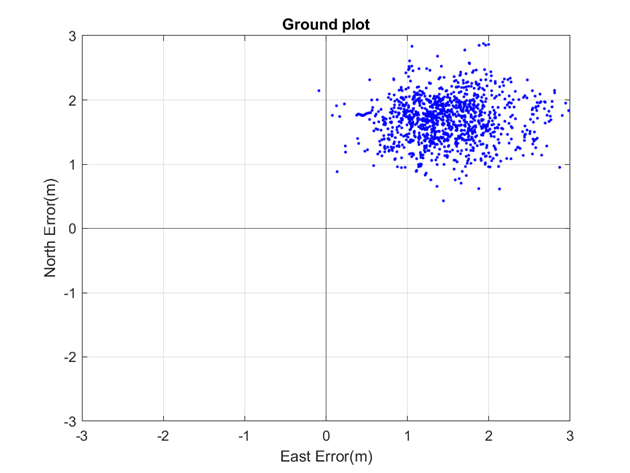
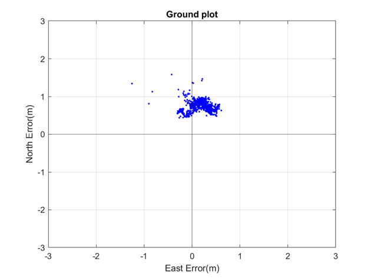
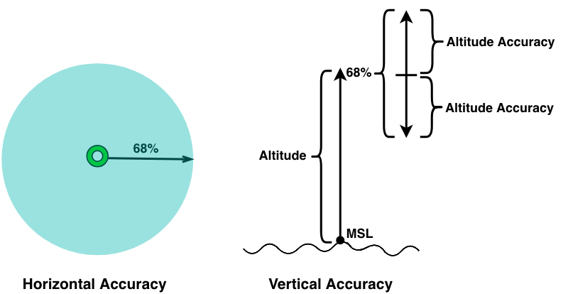

# Optimize Positioning

Below, we present additional options for obtaining precise and reliable location data for a variety of applications.

## Specify location options

If you are targeting **Android devices** and want more control over what options are taken into account when generating the locations, you can create a `LocationOptions` object, configure it to your liking, and start the engine by calling the `startWithLocationOptions(locationOptions)` method.

```dart
// ...

// Create a new LocationOptions object. By default all options are enabled.
LocationOptions locationOptions = LocationOptions();

// Use WiFi and satellite (GNSS) positioning only.
locationOptions.wifiPositioningOptions.enabled = true;
locationOptions.satellitePositioningOptions.enabled = true;
locationOptions.sensorOptions.enabled = false;
locationOptions.cellularPositioningOptions.enabled = false;

// Receive a location approximately every minute, but not more often than every 30 seconds.
locationOptions.notificationOptions.smallestIntervalMilliseconds = 30000;
locationOptions.notificationOptions.desiredIntervalMilliseconds = 60000;

_locationEngine.startWithLocationOptions(locationOptions);

// ...
```

> #### Note
> On iOS platforms, `startWithLocationOptions()` will return `LocationEngineStatus.notSupported`.

The table below shows an overview of the available `LocationAccuracy` modes, and how they are internally translated to `LocationOptions` in Android and to `CLLocationAccuracy` modes in iOS:

<center><p>
<table>
  <tr>
    <th>LocationAccuracy</th>
    <th>LocationOptions (Android)</th>
    <th>CLLocationAccuracy (iOS)</th>
  </tr>
  <tr>
    <td>BEST_AVAILABLE</td>
    <td>
        cellularPositioningOptions.enabled = true <br>
        satellitePositioningOptions.enabled = true <br>
        wifiPositioningOptions.enabled = true <br>
        sensorOptions.enabled = true <br>
        notificationOptions.desired_interval_millisec = 30000 (30s) <br>
        notificationOptions.smallest_interval_millisec = 1000 (1s) <br>
    </td>
    <td>kCLLocationAccuracyBest</td>
  </tr>
  <tr>
    <td>NAVIGATION</td>
    <td>
        cellularPositioningOptions.enabled = false <br>
        satellitePositioningOptions.enabled = true <br>
        wifiPositioningOptions.enabled = true <br>
        sensorOptions.enabled = true <br>
        notificationOptions.desired_interval_millisec = 1000 (1s) <br>
        notificationOptions.smallest_interval_millisec = 1000 (1s) <br>
    </td>
    <td>kCLLocationAccuracyBestForNavigation</td>
  </tr>
  <tr>
    <td>SUB_METER_NAVIGATION</td>
    <td>
        cellularPositioningOptions.enabled = false <br>
        satellitePositioningOptions.enabled = true <br>
        satellitePositioningOptions.hdEnabled = true <br>
        wifiPositioningOptions.enabled = true <br>
        sensorOptions.enabled = true <br>
        notificationOptions.desired_interval_millisec = 1000 (1s) <br>
        notificationOptions.smallest_interval_millisec = 1000 (1s) <br>
    </td>
    <td>N/A</td>
  </tr>
  <tr>
    <td>TENS_OF_METERS</td>
    <td>
        cellularPositioningOptions.enabled = false <br>
        satellitePositioningOptions.enabled = false <br>
        wifiPositioningOptions.enabled = true <br>
        sensorOptions.enabled = true <br>
        notificationOptions.desired_interval_millisec = 30000 (30s) <br>
        notificationOptions.smallest_interval_millisec = 1000 (1s) <br>
    </td>
    <td>kCLLocationAccuracyNearestTenMeters</td>
  </tr>
  <tr>
    <td>HUNDREDS_OF_METERS</td>
    <td>
        cellularPositioningOptions.enabled = true <br>
        satellitePositioningOptions.enabled = false <br>
        wifiPositioningOptions.enabled = true <br>
        sensorOptions.enabled = false <br>
        notificationOptions.desired_interval_millisec = 30000 (30s) <br>
        notificationOptions.smallest_interval_millisec = 1000 (1s) <br>
    </td>
    <td>kCLLocationAccuracyHundredMeters</td>
  </tr>
  <tr>
    <td>KILOMETERS</td>
    <td>
        cellularPositioningOptions.enabled = true <br>
        satellitePositioningOptions.enabled = false <br>
        wifiPositioningOptions.enabled = false <br>
        sensorOptions.enabled = false <br>
        notificationOptions.desired_interval_millisec = 30000 (30s) <br>
        notificationOptions.smallest_interval_millisec = 1000 (1s) <br>
    </td>
    <td>kCLLocationAccuracyThreeKilometers</td>
  </tr>
</table>
</p></center>

> #### Note
> The desired interval is not guaranteed by the `LocationEngine`, so it is possible that the locations will be delivered more or less often. The smallest  interval, on the other hand, guarantees that the locations are not provided more often than the defined value.

## Add sub-meter precision

If you are targeting **Android devices**, starting the `LocationEngine` with `LocationAccuracy.subMeterNavigation` mode will enable HERE HD GNSS positioning. The HD GNSS (**H**igh **D**efinition **G**lobal **N**avigation **S**atellite **S**ystem) feature will allow high definition positioning for various use cases from lane assistance and turn-by-turn guidance to augmented reality. HD GNSS is a cloud-based solution that enables mass market devices to achieve sub-meter accuracy across the globe.

HD GNSS has special requirements for used Android devices. For this feature to work, Android version of the device has to be at least 12 (API 31). More specifically, device must support the following:

- Raw GNSS measurements
- GNSS carrier phase measurements (ADR)
- Dual frequency GNSS receiver (L5)

See also [Android documentation](https://developer.android.com/guide/topics/sensors/gnss) for more details.

It is the responsibility of the user to ensure conditions above hold with the used device. If not, the desired accuracy level may not be reached.

Conditions above do hold for some Android devices with earlier versions also. It is possible to successfully use `LocationAccuracy.SUB_METER_NAVIGATION` mode with some of these versions but this should only be done for development and testing purposes.

<center><p>
  
  
  <figcaption>Example comparison of ground track accuracy of traditional GNSS solution (left) and HERE HD GNSS solution (right).</figcaption>
</p></center>

This feature is not available by default, but has to be separately activated. Users require credentials to gain access to HERE HD GNSS correction data. <!-- markdown-link-check-disable --> [Contact us](https://www.here.com/platform/positioning) <!-- markdown-link-check-enable --> for more details.

> #### Note
> Even if `LocationAccuracy.SUB_METER_NAVIGATION` mode is used, it does not ensure that it will be used in every case, but fallback to other positioning sources and technologies may occur. Typical reasons for this include device not having necessary capabilities, use in environments which can be considered urban where GNSS measurements have lower quality, or when the credentials are not enabled for this feature. For more information about device capabilities and measurement quality, implement the `LocationIssueListener` interface and register it with the location engine's `addLocationIssueListener()` method. Check the API Reference for more information on the different issues.

## Handle location accuracy

The `horizontalAccuracyInMeters` field, which is present in the `Location` object, also known as the "radius of uncertainty", provides an estimate of the area within which the true geographic coordinates are likely to lie with a 68% probability. This is used to draw a halo indicator around the current location. The illustration below depicts the inner green circle as the `location.coordinates` and the surrounding circle as the accuracy circle with a radius of `horizontalAccuracyInMeters`. The true geographical coordinates may lie inside (68%) or outside (32%) the accuracy circle.

<center><p>
  
  <figcaption>Illustration: Radius of horizontal uncertainty and vertical uncertainty.</figcaption>
</p></center>

Likewise, in the case of altitude, if the `verticalAccuracyInMeters` value is 10 meters, this indicates that the actual altitude is expected to fall within a range of altitude - 10m to altitude + 10m with a probability of 68%. Other accuracy values, like `bearingAccuracyInDegrees` and `speedAccuracyInMetersPerSecond` will follow the same rule: a smaller uncertainty results in a better accuracy.

> #### Note
> On Android devices, the `coordinates.altitude` value is given in relation to the WGS 84 reference ellipsoid. On iOS devices, the `coordinates.altitude` value is given in relation to the mean sea level instead.

### Achieving probabilities other than 68% (CEP68)

What if the given probability of 68% (CEP68) is not enough - is it possible to achieve an accuracy of 99%? Yes, it is: Since the given circular error probability (CEP) follows a chi-squared distribution with two degrees-of-freedom, it is easy to calculate the desired probability based on the following formulas:

<center><p>
<table style="width:500">
  <tr>
    <th>Probability</th>
    <th>Radius of Uncertainty</th>
  </tr>
  <tr>
    <td>50%</td>
    <td>CEP50 = 0.78 x CEP68</td>
  </tr>
  <tr>
    <td>60%</td>
    <td>CEP60 = 0.90 x CEP68</td>
  </tr>
  <tr>
    <td>70%</td>
    <td>CEP70 = 1.03 x CEP68</td>
  </tr>
  <tr>
    <td>80%</td>
    <td>CEP80 = 1.19 x CEP68</td>
  </tr>
  <tr>
    <td>90%</td>
    <td>CEP90 = 1.42 x CEP68</td>
  </tr>
  <tr>
    <td>95%</td>
    <td>CEP95 = 1.62 x CEP68</td>
  </tr>
  <tr>
    <td>99%</td>
    <td>CEP99 = 2.01 x CEP68</td>
  </tr>
</table>
</p></center>

The table above can be used to visualize various probability levels for a halo indicator on the map. For example, if the horizontal accuracy is 20 meters, you can (roughly) double the radius to achieve a probability of 99%. The accuracy value is always given as CEP68, that means:

**CEP99 = 2.01 x CEP68 = 2.01 x 20m = 40.2m**

Now you can draw a radius of 40.2 meters around the found location - and with a probability of 99%, the real location will lie within that circle. On the other hand, the probability for a radius of 0 meters is 0%.
