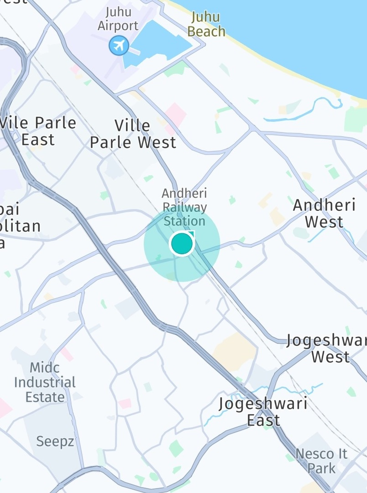

# Get started with Positioning

One of the main reasons to use a mapping application is to find out where you are.

The `LocationEngine` provided by the HERE SDK implements a comprehensive location solution that works with several location sources such as GPS or other Global Navigation Satellite System (GNSS) receivers, mobile network signals and Wi-Fi network signals to determine accurate locations.

If an iOS device itself is capable of GNSS precision depends on the hardware of the iOS device. Sub-meter accuracy is currently not supported by iOS and would require a separate receiver. For Android devices sub-meter accuracy is only supported when your credentials are enabled for this (see below).

Integrating the HERE SDK location features requires at least the following steps:

1. Add the required permissions to your manifest file (for Android) and your `.plist` file (for iOS) and request the permissions from the user.
2. Create a `LocationEngine` and set at least one `LocationListener`.
3. If it is the first launch of the application on Android, inform application user about the collection of characteristics info of near-by mobile and Wi-Fi network signals and make a link to the related [HERE Privacy Notice](https://legal.here.com/here-network-positioning-via-sdk) available to the user. An example of how this may be done via application’s Privacy Policy is presented in our [Example app](https://github.com/heremaps/here-sdk-examples/tree/master/examples/latest/navigate/flutter/positioning_app).
4. On Android confirm that the previous step is done by calling the method confirmHEREPrivacyNoticeInclusion().
5. Start the `LocationEngine` once and set the desired accuracy level.
6. Receive `Location` updates and handle them in your app.

## Add permissions

Flutter itself provides no permission handling. Therefore, you need to adapt a few generated files for your Android and iOS native projects.

Let's start with Android.

Before you can start using the `LocationEngine` in your app on Android devices, you will need to add the required permissions to the app's `AndroidManifest.xml` file (located in `YOUR_PROJECT_DIRECTORY/android/app/src/main/`):

```xml
...
<uses-permission android:name="android.permission.ACCESS_COARSE_LOCATION" />
<uses-permission android:name="android.permission.ACCESS_FINE_LOCATION" />
<uses-permission android:name="android.permission.ACCESS_WIFI_STATE"/>
<uses-permission android:name="android.permission.CHANGE_NETWORK_STATE" />
<uses-permission android:name="android.permission.CHANGE_WIFI_STATE" />
```

<!-- markdown-link-check-disable --><!-- Links to developer.android.com are being reported as false positives -->
> #### Note
> If your application targets Android SDK version 31 or higher, users of your application need to grant the [device's "precise" location](https://developer.android.com/training/location/permissions#upgrade-to-precisew). When being prompted, it is not enough to select the "approximate" precision.
> Therefore, `ACCESS_COARSE_LOCATION` and `ACCESS_FINE_LOCATION` permissions need to be present in your manifest file, as shown above.
> HERE positioning needs the fine location permission in order to use GNSS and to make cellular and WiFi scans. The `ACCESS_COARSE_LOCATION` permission alone is not enough as it would result in an approximate precision which is not enough for HERE positioning to work. In that case, the `LocationEngine` would fail with a `MISSING_PERMISSIONS` error.
>
> The `WAKE_LOCK` permission is not enforced by the HERE SDK, however, if the permission is granted for the application, HERE SDK will use wake locks to ensure that network scans and position calculation are not interrupted by the device going in power save mode. Wake locks are kept only for minimum required time to keep impact on battery consumption as low as possible. It should be noted that Android operating system blames the battery consumption to the application or service that is keeping a wake lock for its duration, so to keep your application appealing for the users you should carefully consider whether wake locks are mandatory for your use case or not.
<!-- markdown-link-check-enable -->

Next, we can move on to iOS.

Add to the app's `Info.plist` file (located in `YOUR_PROJECT_DIRECTORY/ios/Runner/`):

```xml
<key>UIRequiredDeviceCapabilities</key>
<array>
   <string>location-services</string>
   <string>gps</string>
</array>
<key>NSLocationAlwaysAndWhenInUseUsageDescription</key>
   <string>This app needs to access your current location to display it on the map.</string>
<key>NSLocationWhenInUseUsageDescription</key>
   <string>This app needs to access your current location to display it on the map.</string>
<key>NSMotionUsageDescription</key>
   <string>Motion detection is needed to determine more accurate locations, when no GPS signal is found or used.</string>
```

> #### Note
> Note that permission `NSLocationAlwaysAndWhenInUseUsageDescription` is needed only if your application wants to request location updates while on background.

<!-- TODO: uncomment this when example app is ready, and remove below duplicated sentence.
In the example app accompanying this user guide, we use the *permission_handler* plugin to request permissions from the user. Please refer to the [plugin's official site](https://pub.dev/packages/permission_handler) for more information. -->
The *permission_handler* plugin can be used to request specific permissions from the user. Please refer to the [plugin's official site](https://pub.dev/packages/permission_handler) for more information. Alternatively, you can find platform specific code for requesting permissions in the "Find your Location" section of the [Developer Guide for the HERE SDK for Android](https://www.here.com/docs/bundle/sdk-for-android-navigate-developer-guide/page/README.html) and [Developer Guide for the HERE SDK for iOS](https://www.here.com/docs/bundle/sdk-for-ios-navigate-developer-guide/page/README.html).

Not all devices provide the same capabilities and may have certain hardware restrictions that can lead to differences in positioning precision.

> #### Note
> Even recent iPad or Android tablet devices can lack the required `UIRequiredDeviceCapabilities` for `gps`. If present in the `Info.plist` file, the app will not install on such devices: if you remove this capability, the app will install, but the `Location` updates you will receive from the device will have a larger accuracy radius and are therefore quite imprecise - if there is no GPS receiver, the device may fall back to, for example, network positioning.

Prior to using the `LocationEngine`, it may be a good idea to check if the native location functionality is enabled. On most Android devices a user can decide to turn the location functionality on, and even increase the accuracy, by opening the device's **Settings** and navigating to the **Security & location** section. On most iOS devices, a user can navigate to **Settings** -> **Privacy** -> **Location Services** to make sure that the location functionality is on.

## Initialize the LocationEngine

Creating a new `LocationEngine` is simple:

```dart
try {
  _locationEngine = LocationEngine();
} on InstantiationException {
  throw ("Initialization of LocationEngine failed.");
}
```

> #### Note
> It is not possible to initialize the `LocationEngine` during the `Application`'s `onCreate()` lifecycle. Any other point in time is fine. For example, a good place to initialize the engine may be in an `Activity`'s `onCreate()`-method.

## Confirm handling of HERE Privacy notice

On Android the LocationEngine time to time gathers characteristics information about the mobile and Wi-Fi network signals surrounding the mobile device in order to maintain, improve and provide HERE Positioning services used by the HERE SDK. As an example, such information includes the strength of the nearby signals. HERE has a legitimate interest in collecting this information in order to maintain, improve and provide location services. Gathered information does not identify the user, and HERE will only retain anonymized information. See [HERE Privacy Notice](https://legal.here.com/here-network-positioning-via-sdk) for more information.

> #### Note
> By default the app needs to call `locationEngine.confirmHEREPrivacyNoticeInclusion()` as a confirmation that
collection of characteristics info of nearby mobile and Wi-Fi network signals is described in the application's Terms & Conditions, or Privacy Policy, or otherwise made available to the user, with reference to the [HERE Privacy Notice](https://legal.here.com/here-network-positioning-via-sdk). Only in a special case pre-approved by HERE, such as where the app solely targets children, the app can call `locationEngine.confirmHEREPrivacyNoticeException()` to confirm that exception permission has been granted by HERE, and therefore data collection won’t take place and a reference to the [HERE Privacy Notice](https://legal.here.com/here-network-positioning-via-sdk) is not required. If you believe data collection should be disabled in your use case, please [contact](https://www.here.com/contact) your HERE representative.
>
> LocationEngine will be fully functional after calling either of the aforementioned methods.

Before starting the `LocationEngine`, you need to confirm that [HERE Privacy Notice](https://legal.here.com/here-network-positioning-via-sdk) is handled by calling `locationEngine.confirmHEREPrivacyNoticeInclusion()` (or by calling `locationEngine.confirmHEREPrivacyNoticeException()`, if HERE has granted exception – see the note above).

```java
locationEngine.confirmHEREPrivacyNoticeInclusion();
```

## Receive locations

Once the engine is initialized, the last known location can be obtained, as long as the engine has been started at least once before and received at least one position, otherwise `null` will be returned. This information will remain, so the last known location will also be available between application sessions.

```dart
Location? myLastLocation = _locationEngine.lastKnownLocation;

if (myLastLocation != null) {
    // Log the last known location coordinates.
    print("Last known location: " + myLastLocation.coordinates.latitude.toString() + ", " + myLastLocation.coordinates.longitude.toString());
}
```

> #### Note
> Note that the `LocationEngine` does not need to be started nor any listener needs to be set in order to get the last known location. The `Location` object contains a `timestamp` that indicates when that location was received.

Next before starting the `LocationEngine`, it's a good idea to register a `LocationStatusListener` so that you will be notified of changes in the engine's status. To do so, implement the `LocationStatusListener` abstract class and register it with the location engine's `addLocationStatusListener()` method. Check the API Reference for more information on the different statuses.

```dart
class PositioningExample extends State<MyApp> implements LocationStatusListener {

  @override
  onFeaturesNotAvailable(List<LocationFeature> features) {
    for (var feature in features) {
      print("Feature not available: " + feature.toString());
    }
  }

  @override
  onStatusChanged(LocationEngineStatus locationEngineStatus) {
    print("LocationEngineStatus: " + locationEngineStatus.toString());
  }

// ...

// Add the listener.
_locationEngine.addLocationStatusListener(this);
```

> #### Note
> After a successful start, `LocationStatusListener` will always receive status `LocationEngineStatus.engineStarted`, and after a successful stop, it will always receive status `LocationEngineStatus.engineStopped`.

Additionally, through the listener's `onFeaturesNotAvailable()` callback you will be notified of any `LocationFeature` that is not available. If a feature that you need is not available, [contact](https://www.here.com/contact) your HERE representative.

The last thing to consider before starting the engine is registering a `LocationListener`, which provides the `onLocationUpdated()` callback that sends a notification once a new `Location` is detected. You can do so in a similar way as with the previously mentioned `LocationStatusListener`:

```dart
class PositioningExample extends State<MyApp> implements LocationListener {
    @override
    onLocationUpdated(Location location) {
        print("Received location: " + location.coordinates.latitude.toString() + ", " + location.coordinates.longitude.toString());
    }

// ...

// Add the listener.
_locationEngine.addLocationListener(this);
```

> #### Note
> The callback `onLocationUpdated()` is received on the main thread - same as for all other callbacks.

Except for the current geographic coordinates and the timestamp, all other `Location` fields are optional. For example, the received `Location` object may contain the information about the bearing angle, as well as the current speed, but this is not guaranteed to be available. Unavailable values will be returned as `null`.

You can add as many `LocationStatusListener` and `LocationListener` as you need by calling the respective `addLocationStatusListener()` and `addLocationListener()` methods.

For more detailed information about positioning issues, implement the `LocationIssueListener` interface and register it with the location engine's `addLocationIssueListener()` method. Via this interface location engine delivers events describing the cause of error when the location engine is running. Check the API Reference for more information on the different issues.

You are now ready to call the `LocationEngine`'s `startWithLocationAccuracy()` method:

```dart
class PositioningExample extends State<MyApp> implements LocationListener, LocationStatusListener {
    try {
      _locationEngine = LocationEngine();
    } on InstantiationException {
      throw ("Initialization of LocationEngine failed.");
    }

    try {
      _consentEngine = ConsentEngine();
    } on InstantiationException {
      throw ("Initialization of ConsentEngine failed.");
    }

// ...

    if (_consentEngine.userConsentState == ConsentUserReply.notHandled) {
        await _consentEngine.requestUserConsent(context);
    }

    _updateConsentInfo();
    _startLocating();

// ...

void startLocating() {
    _locationEngine.addLocationListener(this);
    _locationEngine.addLocationStatusListener(this);
    _locationEngine.startWithLocationAccuracy(LocationAccuracy.bestAvailable);
}
```

The most straightforward way to start the engine is by passing it one of the pre-defined `LocationAccuracy` modes, as in the code snippet above. See the table below or check the API Reference for more information about all the available modes.

After the `LocationEngine` has been started, you will receive `LocationEngineStatus.alreadyStarted` if you try to start it again without calling `stop()` first. You can use the method `isStarted()` to check if the engine is started or not. Similarly, if you have started a `LocationEngine` and try to start another one without stopping the first, you will get `LocationEngineStatus.alreadyStarted` error. Only one engine can be started at a time.

If you don't want to receive more location updates, you can stop the engine by calling the `stop()` method. Remember to remove the listeners when they are no longer needed:

```dart
void stopLocating() {
    _locationEngine.removeLocationStatusListener(this);
    _locationEngine.removeLocationListener(this);
    _locationEngine.stop();
}
```

In general, it is recommended to listen to the `AppLifecycleState` and to stop the `LocationEngine` when an app gets disposed, see the `positioning_app` for an example on [GitHub](https://github.com/heremaps/here-sdk-examples).

## Pause updates while stationary on iOS devices

On iOS devices the `LocationEngine` will, by default, pause the location updates when location data is not expected to change. This can be used, for example, to improve battery life when the device is stationary. This feature can be controlled by the method `LocationEngine.setPauseLocationUpdatesAutomatically()`.

> #### Note
> On Android platforms, `setPauseLocationUpdatesAutomatically()` will return `LocationEngineStatus.notSupported`.

## Show your location on the map

A `LocationIndicator` is used for representing device's current location on map. Before the indicator is updated with a current location value, a default `Location` is set, which can be the last known location - or just any place the user should see before the first location update arrives. By default, the horizontal accuracy is visualized with a `MapCircle` that has a radius of `horizontalAccuracyInMeters`.

```dart
//Default start-up location.
static final GeoCoordinates _defaultGeoCoordinates = GeoCoordinates(52.530932, 13.384915);

// LocationIndicator object to represent device's current location.
LocationIndicator _locationIndicator;

// ...

void _addMyLocationToMap(Location myLocation) {
  if (_locationIndicator != null) {
    return;
  }
  // Set-up location indicator.
  _locationIndicator = LocationIndicator();
  // Enable a halo to indicate the horizontal accuracy.
  _locationIndicator!.isAccuracyVisualized = true;
  _locationIndicator!.locationIndicatorStyle = LocationIndicatorIndicatorStyle.pedestrian;
  _locationIndicator!.updateLocation(myLocation);
  _locationIndicator!.enable(_hereMapController!);

  // Point camera at given location.
  MapMeasure mapMeasureZoom = MapMeasure(MapMeasureKind.distance, _cameraDistanceInMeters);
  _hereMapController!.camera.lookAtPointWithMeasure(
    myLocation.coordinates,
    mapMeasureZoom,
  );

  // Update state's location.
  setState(() {
    _location = myLocation;
  });
}

// ...

    Location? location = _locationEngine.lastKnownLocation;

    if (location == null) {
        // No last known location, use default instead.
        location = Location.withCoordinates(_defaultGeoCoordinates);
        location.time = DateTime.now();
    }

    _addMyLocationToMap(location);

// ...

void _updateMyLocationOnMap(Location myLocation) {
    if (_locationIndicator == null) {
      return;
    }

    // Update location indicator's location.
    _locationIndicator?.updateLocation(myLocation);

    // Point camera at given location.
    _hereMapController?.camera.lookAtPoint(myLocation.coordinates);

    // Update state's location.
    setState(() {
        _location = myLocation;
    });
}
```

<center><p>
  
  <figcaption>Screenshot: Location indicator showing current location on map.</figcaption>
</p></center>

As shown in the implementation above, you can pass the `Location` object to the location indicator by calling `updateLocation()`. In this example, the goal is to track the user's current location - therefore, the map viewport's center location is updated as well.

## Simulate location updates during development on Simulator/Emulator

### iOS Simulator

- Launch the **iOS Simulator**.
- In the top menu bar, go to **Features** -> **Location** -> **Custom Location**.
- Add the desired location(s).

### Android Emulator

- Launch the **Android Emulator**.
- Open **Extended Controls** by clicking the three dots menu on the emulator window.
- Go to the **Location** tab.
- Add the desired location(s).

## Try the Positioning example apps

- On [GitHub](https://github.com/heremaps/here-sdk-examples/tree/master/examples/latest/navigate/flutter/positioning_app) you can find the "positioning_app" example app covering most code snippets shown above.
- The [HikingDiary](https://github.com/heremaps/here-sdk-examples/tree/master/examples/latest/navigate/flutter/hiking_diary_app) app shows how to record GPX traces.

## Legal requirement
It is the responsibility of the application developer to ensure that application user is informed about the collection of characteristics information of the near-by mobile and Wi-Fi network signals, and that a link to the related HERE Privacy Notice is made available to the user.
This information may be included in the application Terms & Conditions, or Privacy Policy, or otherwise made available to the user.
An example text for informing users about the data collection:
“This application uses location services provided by HERE Technologies. To maintain, improve and provide these services, HERE Technologies time to time gathers characteristics information about the near-by network signals. For more information, please see HERE Privacy Notice at https://legal.here.com/here-network-positioning-via-sdk"

> #### Note
> Note that this requirement only applies to Android applications, as currently there is no data collection in iOS. This might change in the future.
