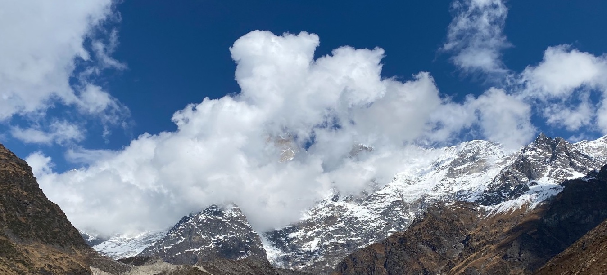
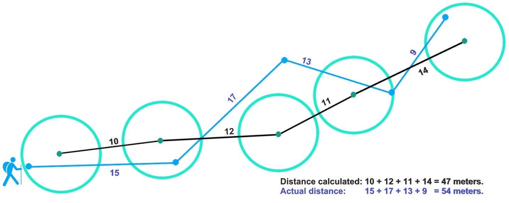
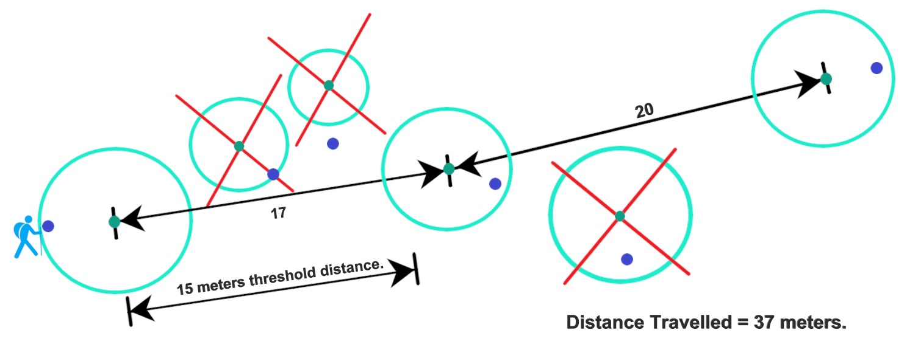

# Build a GPX recording app

Use HERE Positioning to build a digital diary for your adventure trips.

<div align="center"><p>
  
  <figcaption>Way to Chandrashilla trek in the Garhwal Himalayan range, 5000 m AMSL</figcaption>
</p></div>

As adventure enthusiasts, we all know the excitement of documenting our hiking and trekking trips to show our friends and family. While traditional methods such as cameras can provide a visual record of these experiences, they do not capture the exact path taken. In this section, we'll use the [HERE SDK for Flutter (_Navigate Edition_)](https://www.here.com/docs/bundle/sdk-for-flutter-navigate-developer-guide/page/README.html) to record and visualize our audacious trips.

You can use the resulting app as a starting point to create your own customized applications that leverages the HERE SDK's many features and functionalities. Furthermore, the HERE SDK is shipped with ready-made code that you can find on [GitHub](https://github.com/heremaps/here-sdk-examples).

Note that our focus will be on recording GPS signals, rather than counting steps because we want to see our hiking path on the HERE map.

Now, let's delve into the use of the HERE SDK to build our "hiking_diary_app" example.

## Get and show locations

With the code snippets from the HERE SDK found on this [GitHub](https://github.com/heremaps/here-sdk-examples) repo, we can easily copy & paste the code to determine our location by integrating the [HEREPositioningProvider](https://github.com/heremaps/here-sdk-examples/blob/master/examples/latest/navigate/flutter/navigation_app/lib/HEREPositioningProvider.dart) into our app. The`HEREPositioningProvider` utilizes the `LocationEngine` provided by the HERE SDK that uses the platform positioning depending on teh platform iOS or Android, and provides high-precision location data from a variety of sources such as GPS, network location providers, other Global Navigation Satellite System (GNSS) receivers.

As a next step, we can integrate the copied `HEREPositioningProvider` by implementing the `LocationStatusListener` and `LocationListener` in our main class, we named it `HikingApp.dart`, and create a `HEREPositioningProvider` instance in that main class to get started:

```dart
// A class to receive location events from the device.
late HEREPositioningProvider herePositioningProvider;

// Sets list to receive locations from HERE Positioning.
herePositioningProvider.startLocating(this, LocationAccuracy.navigation);

...

// Conform to LocationListener method.
@override
void onLocationUpdated(Location location) {
  ...
}
```

Do not forget to implement the `onLocationUpdated(Location location)` method that conforms to `LocationListener` class. This method is invoked on the main thread and called each time a new `Location` is available.

You can set the accuracy precision of the location updates via accuracy parameter. The `navigation` setting is the highest precision possible.

You can find the final implementation of our `HikingApp` class on [GitHub](https://github.com/heremaps/here-sdk-examples/tree/master/examples/latest/navigate/flutter).

### Add the required permissions

Location tracking raises some privacy concerns, as it may reveal sensitive information about the user's whereabouts and activities. To address these concerns, many mobile platforms require apps to obtain explicit user consent before accessing location data and provide options to control the frequency and granularity of the location tracking. It is important for app developers to handle location data responsibly and in accordance with the privacy regulations and best practices. Hence, before you start using the `LocationEngine` in your app, you need to add the required permissions to the app's `Info.plist` file for iOS platform and to the app's `Android.Manifest.xml` file for Android platform.

For Flutter we use the `permission_handler` plugin to request the required permissions from the user. Take a look at the final project on [GitHub](https://github.com/heremaps/here-sdk-examples/tree/master/examples/latest/navigate/flutter) for more details.

#### Enable background updates

Whenever we go to hike, we usually put our devices into our pocket and leave it there. Therefore, to continue tracking our hike, the app needs to enable background updates. For this, we need to set `locationEngine.setBackgroundLocationAllowed` to true. For the Android platform, we enable background locations, by default. For the iOS platform, we need to enable such capability and the process to do so can be found below:

Add the following key to the app's `Info.plist` file:

```xml
<key>UIBackgroundModes</key>
  <array>
		<string>location</string>
    <string>processing</string>
	</array>
```

The "processing" mode is needed for iOS versions 13.0 and above. When added, also the following is needed:

```xml
<key>BGTaskSchedulerPermittedIdentifiers</key>
    <array>
      <string>$(PRODUCT_BUNDLE_IDENTIFIER)</string>
    </array>
```

Check Apple's [iOS documentation](https://developer.apple.com/documentation/xcode/configuring-background-execution-modes) for more details.

## Handle location accuracy

Now that we are able to receive locations, we have to check the accuracy of the location:

The `Location` object that we receive from `onLocationUpdated` describes the location of the user in the world at a given time and it is just an estimation of the true geographic coordinates. Even if you yourself are stationary, the GNSS satellites are not stationary but travel at a huge speed in the space, which may cause the location estimate to move around. For example, when meditating or having a meal while trekking, the location estimate will vary around my actual location. In such scenarios, the app should not update positions because this way you can travel miles even sitting at home.

Below illustration visualizes the problem with the fluctuation of the received GPS signals:

<div align="center"><p>
  
  <figcaption>Illustration: GPS signal visualization.</figcaption>
</p></div>

The hiking man denotes the location of the user (moving or non-moving). The circle surrounding the man is the accuracy circle whose radius is defined by `horizontalAccuracyInMeters` at any time t1. The blue circles are examples of possible locations at any time t1 with 68% probability of lying inside the horizontal accuracy circle, and 32% probability of lying outside the accuracy circle. For example, if the `horizontalAccuracyInMeters` is 10 meters then it is 68% likely that the true geographic coordinates can lie within the radius of 10 meters. As the hiking man transitions from time t1 to t2, the `horizontalAccuracyInMeters` value decreases, resulting in a reduced accuracy circle. However, the probability of finding the true geographical coordinates within the accuracy circle increases. Hence, we can conclude that smaller accuracy circles have better accuracy than the bigger one.

With a naive implementation, we could just accept the locations that are below a certain accuracy threshold.

This can lead to imprecise distance calculation, as illustrated below:

<div align="center"><p>
  
  <figcaption>Illustration: Problems with distance calculation.</figcaption>
</p></div>

The black lines are the calculated distances based on the GPS signals and the blue lines are the actual distances that are impossible to determine, unless we roll out a rope behind us and track the real path.

How to solve this problem?

## Create location filtering algorithm

To solve the above problems, we need to create a location filtering algorithm that accepts locations only when moving. For this, we will create a new `DistanceAccuracyLocationFilter` class and provide a filtering strategy based on the horizontal accuracy of the location estimate and the distance to our previous location estimate.

For this, we need two types of filters:

1. DistanceFilter: Filters the locations based on a distance threshold.
2. AccuracyFilter: Filters the locations based on the horizontal accuracy of the location estimate, and only includes the readings with a certain level of accuracy. To create this filter we will use the `horizontalAccuracyInMeters` property which is found in the `Location` object provided by the HERE SDK. It gives the estimated horizontal accuracy in meters and tells us that the true geographic coordinates will lie within this radius of uncertainty with a probability of 68% (see first illustration above).

Let's look how we can implement such a distance filter. Firstly, we need to define a `distanceThresholdInMeters` property, let's say 15 meters. We will only accept the GPS signal if the estimated location is beyond the `distanceThresholdInMeters` from the last accepted location. Below illustration visualizes the idea of our planned mechanism:

<div align="center"><p>
  
  <figcaption>Illustration: Distance threshold visualization.</figcaption>
</p></div>

Each circle represents a single location estimate with a varying accuracy circle. The crossed circles are below the distance threshold and therefore discarded.

On top of the distance filter, we also need to consider the accuracy of each GPS signal (see above). For this we define a `accuracyRadiusThresholdInMeters` property. Let's say it is 10 meters. Therefore, each GPS signal with a higher value than `accuracyRadiusThresholdInMeters` will be filtered out. In our first illustration above, this would mean that all blue GPS signals are accepted and the red ones are discarded.

Now, we are ready to go for the implementation of our algorithm using the two filter mechanisms:

```dart
abstract class LocationFilterAbstract {
  bool checkIfLocationCanBeUsed(Location location);
}

class DistanceAccuracyLocationFilter implements LocationFilterAbstract {
  // These two parameters define if incoming location updates are considered to be good enough.
  // In the field, the GPS signal can be very unreliable, so we need to filter out inaccurate signals.

  static const double accuracyRadiusThresholdInMeters = 10.0;
  static const double distanceThresholdInMeters = 15.0;
  GeoCoordinates? lastAcceptedGeoCoordinates;

  @override
  bool checkIfLocationCanBeUsed(Location location) {
    if (_isAccuracyGoodEnough(location) && _isDistanceFarEnough(location)) {
      lastAcceptedGeoCoordinates = location.coordinates;
      return true;
    }
    return false;
  }

  // Checks if the accuracy of the received GPS signal is good enough.
  bool _isAccuracyGoodEnough(Location location) {
    final horizontalAccuracyInMeters = location.horizontalAccuracyInMeters;
    if (horizontalAccuracyInMeters == null) {
      return false;
    }

    // If the location lies within the radius of accuracyRadiusThresholdInMeters then we accept it.
    if (horizontalAccuracyInMeters <= accuracyRadiusThresholdInMeters) {
      return true;
    }
    return false;
  }

  // Checks if the last accepted location is farther away than xx meters.
  // If it is, the new location will be accepted.
  // This way we can filter out signals that are caused by a non-moving user.
  bool _isDistanceFarEnough(Location location) {
    if (lastAcceptedGeoCoordinates == null) {
      // We always accept the first location.
      lastAcceptedGeoCoordinates = location.coordinates;
      return true;
    }

    final distance = location.coordinates.distanceTo(lastAcceptedGeoCoordinates!);
    if (distance >= distanceThresholdInMeters) {
      return true;
    }
    return false;
  }
}
```

The [DistanceAccuracyLocationFilter](https://github.com/heremaps/here-sdk-examples/tree/master/examples/latest/navigate/flutter) algorithm can be also found on the HERE SDK GitHub repo.

Now, we can create an instance of `DistanceAccuracyLocationFilter` and filter out the incoming location signals and update the locations on the map:

```dart
LocationFilterAbstract? locationFilter;

...

// Filter out undesired location signals.
locationFilter = DistanceAccuracyLocationFilter();

...

@override
void onLocationUpdated(Location location) {
  if (locationFilter!.checkIfLocationCanBeUsed(location)) {
    // Use the location.
  }
}
```

You can also create your own location filter algorithm by adopting the [LocationFilterAbstract](https://github.com/heremaps/here-sdk-examples/tree/master/examples/latest/navigate/flutter) class. For example, you can implement a bypass filter like this:

```dart
// The DefaultLocationFilter class implements the LocationFilterAbstract protocol and
// allows every location signal to pass inorder to visualize the raw GPS signals on the map.
class DefaultLocationFilter implements LocationFilterAbstract {
  @override
  bool checkIfLocationCanBeUsed(Location location) {
    return true;
  }
}
```

With the `LocationFilterAbstract` you can customize the app to use different algorithms for location filtering without changing the core functionality of the app. Note that our filtering algorithm above is kept as simple as possible, it can be improved as per your needs.

## Record location updates

Once we have the location updates, the next step is to record them. For this, we use a `GPXTrackWriter` code snippet from the HERE SDK GitHub that allows us to create a `GPXTrack`. This `GPXTrack` can be stored and loaded with the `GPXDocument` class. The `GPXDocument` contains all the GPX tracks and is saved in the [GPX](https://www.topografix.com/gpx.asp) file format. Hence, once saved, it can be easily shared with other applications that understand the GPX file format.

GPX is a de facto standard data format for GPS data exchange, including waypoints, tracks, and routes. GPX files contain geographical information in XML format and are easy to process with various software programs and GPS devices.

The HERE SDK can help with GPX data by providing tools for reading, displaying, and manipulating GPX data in a variety of ways.

For recording the location updates, create an instance of [GPXManager](https://github.com/heremaps/here-sdk-examples/tree/master/examples/latest/navigate/flutter) to manage our GPX operations:

```dart
GPXTrackWriter gpxTrackWriter = GPXTrackWriter();
late GPXManager gpxManager;

// Create a GPXDocument file with named as myGPXDocument.
gpxManager = GPXManager("myGPXDocument.gpx", context);
```

Now, we can write location updates to a `GPXTrack` inside the `onLocationUpdated()` method:

```dart
// Add location updates to a GPX track.
gpxTrackWriter.onLocationUpdated(location);
```

Finally, to store the hiking trip, we use this one-liner code that stores the GPX track in a `GPXDocument`:

```dart
// Permanently store the trip on the device.
gpxManager.saveGPXTrack(gpxTrackWriter.track);
```

In order to load our trips, call:

```dart
GPXTrack? gpxTrack = gpxManager.getGPXTrack(index);
if (gpxTrack == null) {
  return;
}
```

You can record and store multiple hiking trips as multiple `GPXTrack` in a single `GPXDocument`.

## Finalize the app

Now, in order to complete our app, we show the travelled path with a `MapPolyline` on the map. The implementation of a `MapPolyline` follows the [Map Items Guide](https://www.here.com/docs/bundle/sdk-for-flutter-navigate-developer-guide/page/topics/map-items.html#add-map-polylines) that can be found in the [Developer Guide for the HERE SDK](https://www.here.com/docs/bundle/sdk-for-flutter-navigate-developer-guide/page/README.html). It can be also seen in the [`HikingApp.dart`](https://github.com/heremaps/here-sdk-examples/tree/master/examples/latest/navigate/flutter) class.

In order to extend the polyline during the trip, we take the latest list of coordinates from the `gpxManager` instance, since it already contains the latest location updates. With this list we can create a new `geoPolyline` instance that we set to our existing `mapPolyline` instance:

```dart
// Update the polyline shape that shows the travelled path of the user.
mapPolyline!.geometry = geoPolyline;
```

This will immediately extend the polyline that is already shown on the map view.

Note that in this tutorial we did not covered every step of the app development process. To get a more complete picture, take a look at this [Get started](https://www.here.com/docs/bundle/sdk-for-flutter-navigate-developer-guide/page/topics/integrate-here-sdk.html) guide.

You can find the complete Xcode project on [GitHub](https://github.com/heremaps/here-sdk-examples/tree/master/examples/latest/navigate/flutter).

Below you can see the finished app:

<div align="center">
<table>
  <tr align="center">
    <td align=center style="width: 33%">
      
      <figcaption>Screenshot: HikingDiary app with satellite map scheme.</figcaption>
    </td>
    <td align=center style="width: 33%">
      
      <figcaption>Screenshot: HikingDiary app with outdoor raster layer.</figcaption>
    </td>
  </tr>
</table>
</div>

The HERE SDK provides various map schemes. By default, in our app we show the `satellite` map scheme. However, you can change the `MapScheme` and switch to a different map scheme. To know more about the available `MapScheme` options, you can refer to the API Reference of the HERE SDK.

Also, in our app, you can enable an outdoor raster layer on top of the map view by sliding a switch at the top-right corner of the main view. Note that this is a third-party raster layer that can be suitable for hiking trips, as it shows height lines and more detailed paths. Here, we use an outdoor map from [thunderforest.com](https://www.thunderforest.com). More information about custom raster layers can be found in the [Developer Guide for the HERE SDK](https://www.here.com/docs/bundle/sdk-for-flutter-navigate-developer-guide/page/topics/custom-map-styles.html#load-custom-raster-layers).

### Next steps

There are multiple ways to enhance our little "hiking_diary_app" example. Below are some ideas:

- Use the `altitude` property of the `GeoCoordinates` object to include a height profile of your trip.
- Integrate more map schemes, for example, the HERE SDK offers a `terrain` scheme that provides hill shading.
- Store your trips with the overall duration and timestamps where you took rests.
- Include an export option of the stored GPX file to share it with other applications.

Since we released the app as an open source project on [GitHub](https://github.com/heremaps/here-sdk-examples/tree/master/examples/latest/navigate/flutter), contributions are welcome! Feel free to submit pull requests with bug fixes, new features, and overall improvements.

Happy hiking!
