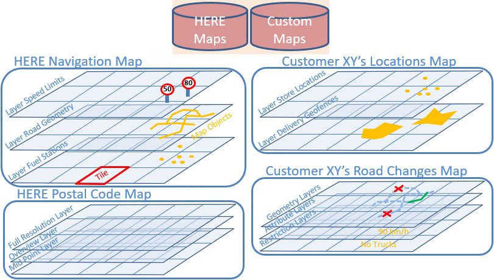

# Use custom map catalogs

The HERE SDK can be configured to consume custom map catalogs. This allows to use the HERE SDK with customized map data. For example, those can include your custom road networks or points of interest.  

Similar to standard map catalogs, custom map data can be used by HERE SDK in both online and offline modes.   

The creation of custom map catalogs - for example, with your custom road geometry or POIs - requires HERE support and an additional agreement with HERE. Please contact your HERE representative for more details.

Once this step is completed, you can use the below code examples to load and use your custom map data in your application.

## Customize map data with the CatalogConfiguration

By default, the HERE SDK uses map data that is compiled into a specialized map format. This data is downloaded into the map cache on-the-fly - or it can be downloaded in advance with offline maps. The _Navigate Edition_ uses the [OCM](https://www.here.com/docs/bundle/optimized-client-map-developer-guide/page/README.html) map catalog format.

<center><p>

<figcaption>Illustration: Custom map layer.</figcaption>
</p></center>

A map catalog is identified through its Here Resource Name (HRN). By default, the HERE SDK contains the OCM catalog with the HRN: "hrn:here:data::olp-here:ocm". Every catalog is a collection of layers that contain map objects with geometry and attributions. A layer's content is cut into tiles, for efficient search, map display, routing, map matching, driver warnings and other data. The core map content is divided into regional maps, but can always be used as a single, global map. Other content is delivered in dedicated - mostly worldwide - maps.

This data can be customized together with HERE and then made accessible via a custom catalog. Once the catalog is ready, you can access it by specifying the HRN value and scope. More information on the HRN catalog identifier and setting a scope can be found [here](billing.md#set-a-scope-to-differentiate-multiple-apps).

On top, you may also want to adapt certain HERE online services such as routing and search to match the data of the offline maps data. In this case, HERE can help to setup a custom backend that hosts the adapted HERE services just for your company. Such a custom backend can be specified via an `EngineBaseURL` and then all requests that are initiated with, for example, the `SearchEngine` will use that backend.

> #### Note
> Setting custom backends via self-hosting is optional and only required when you want to use services such as custom routing or custom search online.
>
> - When custom OCM data is installed on a device via `MapDownloader` or fully cached, then features like custom routing via `OfflineRoutingEngine` are fully supported offline without the need for self-hosting of custom backends.
> - For online use a custom backend URL needs to be specified for the service (see below): Only with a custom backend you can create custom routes online with the `RoutingEngine`. Same for other services like online search via `SearchEngine`.

When a custom catalog is available on the HERE platform you can load and use your map data with a custom `CatalogConfiguration`. A `CatalogConfiguration` along with optional custom backend URLs needs to be specified via `SDKOptions` each time the HERE SDK is initialized - as the setting is not persisted.

The below code snippet shows how to do this:

```dart
void _initializeHERESDKWithCustomCatalogConfiguration() async {
  // Note: Each catalog configuration may require special credentials.
  final accessKeyID = "YOUR_ACCESS_KEY_ID";
  final accessKeySecret = "YOUR_ACCESS_KEY_SECRET";
  AuthenticationMode authenticationMode = AuthenticationMode.withKeySecret(accessKeyId, accessKeySecret);
  SDKOptions sdkOptions = SDKOptions.withAuthenticationMode(authenticationMode);

  sdkOptions.catalogConfigurations = _getCustomCatalogConfiguration();

  // Optionally, specify a custom routing backend that matches the custom OCM map for use with the (online) RoutingEngine.
  sdkOptions.customEngineBaseUrls = _getCustomBackends();

  try {
    await SDKNativeEngine.makeSharedInstance(sdkOptions);
  } on InstantiationException {
    throw Exception("Failed to initialize the HERE SDK.");
  }

  SDKNativeEngine.sharedInstance?.setAccessScope(_getCustomCatalogScope());
}

List<CatalogConfiguration> _getCustomCatalogConfiguration() {
  List<CatalogConfiguration> catalogConfigurations = [];

  // We want to start with the latest catalog version.
  bool ignoreCachedData = true;
  CatalogVersionHint versionHint = CatalogVersionHint.latestWithIgnoringCachedData(ignoreCachedData);

  final customHRN = "hrn:here:data::olp-namespace:your-company-ocm";
  DesiredCatalog customOCMCatalog = new DesiredCatalog(customHRN, versionHint);
  catalogConfigurations.add(new CatalogConfiguration(customOCMCatalog));

  // Optionally, set a patch HRN to enable incremental map updates.

  return catalogConfigurations;
}

// Note that self-hosting is optional.
Map<EngineBaseURL, String> _getCustomBackends() {
  return {
    EngineBaseURL.routingEngine: 'https://your-company.router.hereapi.com',
  };
}

String _getCustomCatalogScope() {
  return "hrn:here:authorization::olp-here:project/your-company-hsdk";
}
```
Initially, you need to specify a catalog version you want to start with. The `DesiredCatalog` provides a way to identify a catalog on the HERE platform. A developer can also specify the HERE Resource Name (HRN) for the catalog along with a `CatalogVersionHint` for the desired version. Once set up, you can use regular map updates via `MapUpdater` (not available for all editions). This catalog version will then appear as part of the `MapVersionHandle`.

Make sure to set optionally `catalogConfiguration.patchHrn = "hrn:here:data::olp-namespace:__your-patch-hrn-123__"` when you want to enable incremental map updates for the custom OCM map. Use the appropriate patch HRN value for your project. Usually, incremental map updates are enabled by default, but when a `CatalogConfiguration` is set, then this behaves differently: setting the `patchHrn` to `null` will disable incremental map updates and for a `CatalogConfiguration` that is newly created, this is the default state.

More information on custom map data can be found in the [HERE Map Attributes API](https://www.here.com/docs/bundle/map-attributes-api-developer-guide/page/topics/here-map-content.html) which allows to access all HERE map data as well as the private map data of a customer.

## Self-hosted services

With `customEngineBaseUrls` (see above), it is possible to self-host services for the HERE SDK, for example, you can mirror the backend for HERE services on your own servers and access them by setting a URL per `EngineBaseURL`.

The access to your own backend is fully customizable with configurable endpoints including authentication and proxy support (see [here](#set-a-ds-proxy)).

This step is only needed when you want to ensure that you can use the online feature engines of the HERE SDK. For example, if you want to insert a custom POI layer, you can search this customized map data already with the `OfflineSearchEngine`. Alternatively, you can also use the `MyPlaces` API to insert your data at runtime - or handle your requests in-app with your own REST code and your own (remote) databases or servers. On the other hand, if you want to make use of, for example, the `SearchEngine`, then you should consider the effort of self-hosting, because then each online request needs to be handled on your self-hosted backend. However, the most common use case for self-hosting is to have full control over the accessed servers that respond to the requests that the HERE SDK will initiate.

Note that this requires quite some effort and it is recommended to get in touch with the HERE SDK [support team](https://www.here.com/contact) to discuss your setup and possible alternatives.

> #### Note
> Despite hosting selected HERE online services on your own backends, it is also possible to host custom OCM map catalogs on your backends (on-premise). Self-hosted maps may help when you need to move all HERE services to your own network behind a firewall. This requires to use a DS Proxy (see below). Please talk to your HERE representative about the details for such an option.

## Set a DS proxy

By default, the data service proxy, in short `dsProxy`, is set to <!-- markdown-link-check-disable -->"https://direct.data.api.platform.here.com/direct/v1"<!-- markdown-link-check-enable -->, which will be used as a prefix for HERE platform requests. When a custom catalog should be used, then the HERE SDK will internally do a lookup request to find out the corresponding URL to access a catalog. In order to bypass this extra request, we recommend to set the URL upfront when initializing the HERE SDK.

For example, a valid `dsProxy` for a custom catalog may look like this: <!-- markdown-link-check-disable -->"https://data.api.platform.yourcompany.com/direct/v1"<!-- markdown-link-check-enable -->.

Set the custom proxy via `EngineBaseURL` and pass it as `customEngineBaseUrls` to `SDKOptions` when initializing the HERE SDK.

In addition, for self-hosted backends and/or self-hosted maps (on-premise) an authentication token needs to be acquired manually by calling `Authentication.authenticate(…)`. Before initializing the HERE SDK, set the token via `AuthenticationMode.withToken(…)`.

> #### Note
> The `dsProxy` is not a network proxy setting: it only specifies the URL to access a catalog. If you do not want to load a custom catalog configuration (see above), you can ignore this setting.

## Use custom catalogs together with Japan

Once your [credentials are enabled by the HERE team for Japan](customization-catalogs.md#configure-a-japan-map), you can set the Japan map HRN string `"hrn:here:data::olp-here:ocm-japan"` to a `DesiredCatalog` instance. Then create a new `CatalogConfiguration` and pass it to `sdkOptions.catalogConfigurations` like already shown above.

Note that the below instructions are only relevant when you are using custom catalogs. If you do not use custom catalogs, you only need [enabled credentials](customization-catalogs.md#configure-a-japan-map) to see the enriched Japan map.

A Japan catalog can be set on it's own or together with a default map which is covering the whole world. By default, this is OCM, identified by this HRN value: `"hrn:here:data::olp-here:ocm"`. Replace this with the custom HRN of your catalog. Below you can see how to use a Japan catalog together with a whole-world catalog.

```dart
List<CatalogConfiguration> _getDefaultCatalogConfigurationWithJapan() {
  List<CatalogConfiguration> catalogConfigurations = [];

  // We want to start with the latest catalog version.
  bool ignoreCachedData = true;
  CatalogVersionHint versionHint = CatalogVersionHint.latestWithIgnoringCachedData(ignoreCachedData);

  // An OCM catalog is required, typically, use your own catalog HRN here.  
  final defaultOCMHRN = "hrn:here:data::olp-here:ocm";
  DesiredCatalog defaultOCMCatalog = new DesiredCatalog(defaultOCMHRN, versionHint);
  catalogConfigurations.add(new CatalogConfiguration(defaultOCMCatalog));

  // Specify a rich Japan map, requires special HERE credentials.
  // If the credentials are not enabled for access, the map falls back to the Japan base map.
  final japanOCMHRN = "hrn:here:data::olp-here:ocm-japan";
  DesiredCatalog japanOCMCatalog = new DesiredCatalog(japanOCMHRN, versionHint);
  catalogConfigurations.add(new CatalogConfiguration(japanOCMCatalog));

  // Optionally, set a patch HRN to enable incremental map updates.

  return catalogConfigurations;
}
```

Make sure to set optionally `catalogConfiguration.patchHrn = "hrn:here:data::olp-here:ocm-japan-patch"` when you want to enable incremental map updates for the Japan map. Usually, incremental map updates are enabled by default, but when a `CatalogConfiguration` is set, then - for now - this behaves differently: Setting the
`patchHrn` to `null` will disable incremental map updates and for a `CatalogConfiguration` that is newly created, this is the default state.

For convenience, you can also get the default configuration like this:

```dart
// By calling getDefault() you will automatically get the latest version
// at the time when the HERE SDK was built.
catalogConfigurations.add(CatalogConfiguration.getDefault(CatalogType.optimizedClientMap));

// Specify a rich Japan map, requires special HERE credentials.
// Note: If the credentials are not enabled for access, the map falls back to the Japan base map.
catalogConfigurations.add(CatalogConfiguration.getDefault(CatalogType.optimizedClientMapJapan));
```

You can also retrieve the details of a default catalog like shown below:

```dart
CatalogConfiguration catalogJapan = CatalogConfiguration.getDefault(CatalogType.optimizedClientMapJapan);
CatalogIdentifier catalogIdentifier = catalogJapan.catalog.id;
print("Japan HRN: " + catalogIdentifier.hrn);
print("Japan version: " + catalogIdentifier.version.toString());
```
