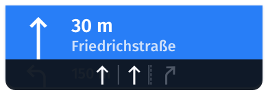

# Get lane assistance

The HERE SDK provides lane recommendations to help a driver to stay on the route. When no `Route` is set, no lane assistance is provided.

> #### Note
> This API can be used to visualize the provided information on the screen, for example, to highlight the lanes to take. It does not provide localized text snippets that can be used for [TTS engines](navigation-voice-guidance.md).

Two independent listeners can be set to obtain the following events before reaching a junction (including intersections and roundabouts):

- `ManeuverViewLaneAssistance`: Provides a list of `Lane` recommendations if the next route maneuver takes place at a junction - regardless if the junction is considered complex or not.
- `JunctionViewLaneAssistance`: Provides a list of `Lane` recommendations only for complex junctions - regardless if a maneuver takes place at the junction or not. This event is not delivered for non-complex junctions.

A complex junction is defined as follows:

- The junction has at least a bifurcation.
- The junction has at least two lanes whose directions do not follow the current route.

Both events can be delivered for the same junction or for different ones. A `Lane` instance contains information such as the available lanes on the current road, their direction category and whether the lane is recommended or not.

Both events are fired 300 meters ahead of a junction for non-highways and 1300 meters ahead of a junction on highways. However, for now the distance to the next complex junction is not exposed as part of the `JunctionViewLaneAssistance` event. For `ManeuverViewLaneAssistance`, the distance is available as part of the distance to the next maneuver which is available via the `RouteProgress` event.

Each lane can lead to multiple directions stored in `LaneDirectionCategory`:

- `straight`: A lane that goes straight up.
- `slightlyLeft`: A lane that goes slightly left around 45 degrees.
- `slightlyRight`: A lane that goes slightly right around 45 degrees.
- `quiteLeft`: A lane that goes quite left around 90 degrees.
- `quiteRight`: A lane that goes quite right around 90 degrees.
- `hardLeft`: A lane that goes hard left around 135 degrees.
- `hardRight`: A lane that goes hard right around 135 degrees.
- `uTurnLeft`: A lane that makes a left u-turn around 180 degrees.
- `uTurnRight`: A lane that makes a right u-turn around 180 degrees.

Note that all members can be `true` or `false` at the same time. Theoretically, all members can be `true` when the lane leads to all multiple directions. Most lanes, however, lead to one or two directions, for example, `quiteLeft` and `quiteRight` will be `true` when the lane splits up into two separate lanes.

To give visual feedback for the driver, it is recommended to create one transparent image asset for each of the nine possible directions. Each image can then be used as an overlay and several images can be blended into one lane pictogram that indicates the possible directions per lane on a road.

> #### Note
> For visualization, you can use the open source [icons provided for lane assistance](https://github.com/heremaps/here-icons/tree/master/icons/guidance-icons/lane-assistance) from the HERE Icon Library.

Most importantly, while the vehicle is traveling along the route, you can tell the driver which lane to take: this information is stored in the `Lane.recommendationState` and it is recommended to highlight the pictogram of the recommended lane.

<center><p>
  
  <figcaption>Illustration: Example of a possible visualization for a road with three lanes where the two leftmost roads lead to the next maneuver.</figcaption>
</p></center>

Note that the lane assistance information does not contain the lanes of the contraflow, instead it only describes the lanes of the current driving direction. The list of lanes is always ordered from the leftmost lane (index 0) to the rightmost lane (last index) of the road.

This way, lane assistance works the same for both, left-hand and right-hand driving countries.

> #### Note
> Check `roadAttributes.isRightDrivingSide` to know if you are in a left-hand driving country. Maneuver instructions and other notifications automatically adapt to the country. For lane assistance, the code will work the same, regardless of the country, as the list of lanes is always ordered from left - starting with index 0 - to right.

It is recommended to show `ManeuverViewLaneAssistance` events immediately when the event is received. The event is synchronized with the `EventTextListener`.

Lane information provided by `JunctionViewLaneAssistance` events is recommended to be shown in a separate UI area indicating that there is an upcoming complex junction that needs attention.

## Get lane recommendations for maneuvers at a junction with ManeuverViewLaneAssistance

The `ManeuverViewLaneAssistance` event provides the recommended lanes at a junction where a maneuver takes place. On the map this maneuver is visualized by a maneuver arrow when the `VisualNavigator` is rendering the `MapView`. The location of the junction can be retrieved from the next `Maneuver` that is available as part of the `RouteProgress` event.

You can attach a `ManeuverViewLaneAssistanceListener` to the `Navigator` or `VisualNavigator`. The resulting `ManeuverViewLaneAssistance` object contains information about the available lanes on the current road and information such as their directions.

The following code snippet shows how to retrieve the information which lanes to take:

```dart
// Notifies which lane(s) lead to the next (next) maneuvers.
_visualNavigator.maneuverViewLaneAssistanceListener =
    ManeuverViewLaneAssistanceListener((ManeuverViewLaneAssistance laneAssistance) {
  // Handle events from onLaneAssistanceUpdated().
  // This lane list is guaranteed to be non-empty.
  List<Lane> lanes = laneAssistance.lanesForNextManeuver;
  logLaneRecommendations(lanes);

  List<Lane> nextLanes = laneAssistance.lanesForNextNextManeuver;
  if (nextLanes.isNotEmpty) {
    print("Attention, the next next maneuver is very close.");
    print("Please take the following lane(s) after the next maneuver: ");
    logLaneRecommendations(nextLanes);
  }
});

...

void logLaneRecommendations(List<Lane> lanes) {
  // The lane at index 0 is the leftmost lane adjacent to the middle of the road.
  // The lane at the last index is the rightmost lane.
  int laneNumber = 0;
  for (Lane lane in lanes) {
    // This state is only possible if laneAssistance.lanesForNextNextManeuver is not empty.
    // For example, when two lanes go left, this lanes leads only to the next maneuver,
    // but not to the maneuver after the next maneuver, while the highly recommended lane also leads
    // to this next next maneuver.
    if (lane.recommendationState == LaneRecommendationState.recommended) {
      print("Lane $laneNumber leads to next maneuver, but not to the next next maneuver.");
    }

    // If laneAssistance.lanesForNextNextManeuver is not empty, this lane leads also to the
    // maneuver after the next maneuver.
    if (lane.recommendationState == LaneRecommendationState.highlyRecommended) {
      print("Lane $laneNumber leads to next maneuver and eventually to the next next maneuver.");
    }

    if (lane.recommendationState == LaneRecommendationState.notRecommended) {
      print("Do not take lane $laneNumber to follow the route.");
    }

    _logLaneDetails(laneNumber, lane);

    laneNumber++;
  }
}

void _logLaneDetails(int laneNumber, Lane lane) {
  // All directions can be true or false at the same time.
  // The possible lane directions are valid independent of a route.
  // If a lane leads to multiple directions and is recommended, then all directions lead to
  // the next maneuver.
  // You can use this information like in a bitmask to visualize the possible directions
  // with a set of image overlays.
  LaneDirectionCategory laneDirectionCategory = lane.directionCategory;
  print("Directions for lane " + laneNumber.toString());
  print("laneDirectionCategory.straight: " + laneDirectionCategory.straight.toString());
  print("laneDirectionCategory.slightlyLeft: " + laneDirectionCategory.slightlyLeft.toString());
  print("laneDirectionCategory.quiteLeft: " + laneDirectionCategory.quiteLeft.toString());
  print("laneDirectionCategory.hardLeft: " + laneDirectionCategory.hardLeft.toString());
  print("laneDirectionCategory.uTurnLeft: " + laneDirectionCategory.uTurnLeft.toString());
  print("laneDirectionCategory.slightlyRight: " + laneDirectionCategory.slightlyRight.toString());
  print("laneDirectionCategory.quiteRight: " + laneDirectionCategory.quiteRight.toString());
  print("laneDirectionCategory.hardRight: " + laneDirectionCategory.hardRight.toString());
  print("laneDirectionCategory.uTurnRight: " + laneDirectionCategory.uTurnRight.toString());

  // More information on each lane is available in these bitmasks (boolean):
  // LaneType provides lane properties such as if parking is allowed.
  LaneType laneType = lane.type;
  // LaneAccess provides which vehicle type(s) are allowed to access this lane.
  LaneAccess laneAccess = lane.access;
}
```

The `laneAssistance.lanesForNextNextManeuver` is normally an empty list, but there may be cases when two maneuvers are very close. In such cases, this list holds the information for the lanes to take immediately after the current maneuver is reached.

Until the next maneuver is reached, the information about the lanes to take is valid. It should be hidden once the next maneuver is reached or replaced by the information contained in any new `ManeuverViewLaneAssistance` event:

```dart
// See above code snippet for the RouteProgressListener.
if (_previousManeuverIndex != nextManeuverIndex) {
  // A new maneuver: Remove stale lane assistance info.
}
```

View the code for the `RouteProgressListener` above and you can find how to get the `nextManeuverIndex`, which will tell you when a new maneuver has to be taken.

## Get lane recommendations for complex junctions with JunctionViewLaneAssistance

In  addition to `ManeuverViewLaneAssistance` (see above), the HERE SDK provides `JunctionViewLaneAssistance` events that notify on the available lanes at complex junctions - even if there is no actual maneuver happening at that junction. These notifications work in parallel to `ManeuverViewLaneAssistance`, but will only fire before reaching a complex junction (see above).

In comparison to `ManeuverViewLaneAssistance`, the `JunctionViewLaneAssistance` event can recommend more lanes to safely pass a complex junction - but not every of those lanes may lead to the next maneuver after passing the junction.

Unlike `ManeuverViewLaneAssistance`, you can detect when the junction has been passed by checking the list if it is empty or not:

```dart
// notifies which lane(s) lead to the next maneuvers at complex junctions.
_visualNavigator.junctionViewLaneAssistanceListener =
    JunctionViewLaneAssistanceListener((JunctionViewLaneAssistance junctionViewLaneAssistance) {
  List<Lane> lanes = junctionViewLaneAssistance.lanesForNextJunction;
  if (lanes.isEmpty) {
    print("You have passed the complex junction.");
  } else {
    print("Attention, a complex junction is ahead.");
    logLaneRecommendations(lanes);
  }
});
```

When the complex junction has been passed, it is recommended to update the UI of your app to remove the lane information. `JunctionViewLaneAssistance` events can be considered as an additional hint which lanes to take at complex junctions - especially, when no maneuver takes places at such junctions, because this information is not provided with the `ManeuverViewLaneAssistance` event.

Keep in mind, that without a route to follow, you will not get any lane assistance related events.

## Get lane assistance for the current lane

With the `CurrentSituationLaneAssistanceViewListener` you can receive lane-based information on the access, type and direction of the lanes of the current road a user is driving on.

Note that this is supported for tracking mode without following a route and for turn-by-turn navigation.

Similar as for `ManeuverViewLaneAssistance` and `JunctionViewLaneAssistance` the current lane a user is driving on is not highlighted - as the GPS signal may not be accurate enough to precisely determine the current lane.

However, `ManeuverViewLaneAssistance` and `JunctionViewLaneAssistance` require a route to follow and inform on upcoming events ahead - the default distance is 1.5 km. In opposition, `CurrentSituationLaneAssistanceView` provides information on the current lanes - based on the current location of a user. This information is updated for each location update and a notification is sent when the lane information has changed.

All three warners are not connected in any way and can be used simultaneously, if desired.

Note that not all roads contain lane information. However, HERE is updating this information with each new map update around the world.
