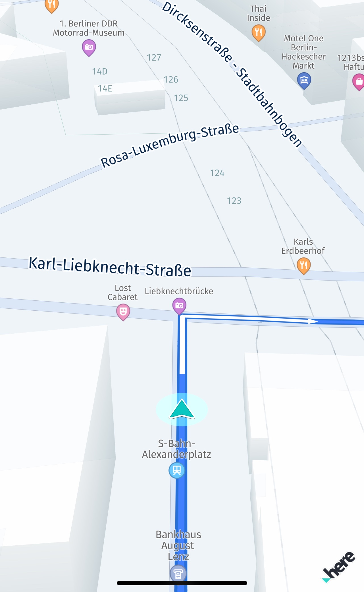
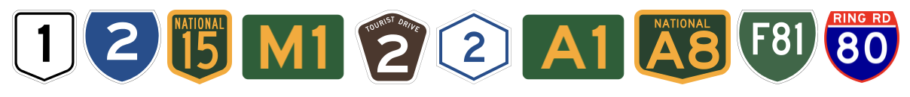
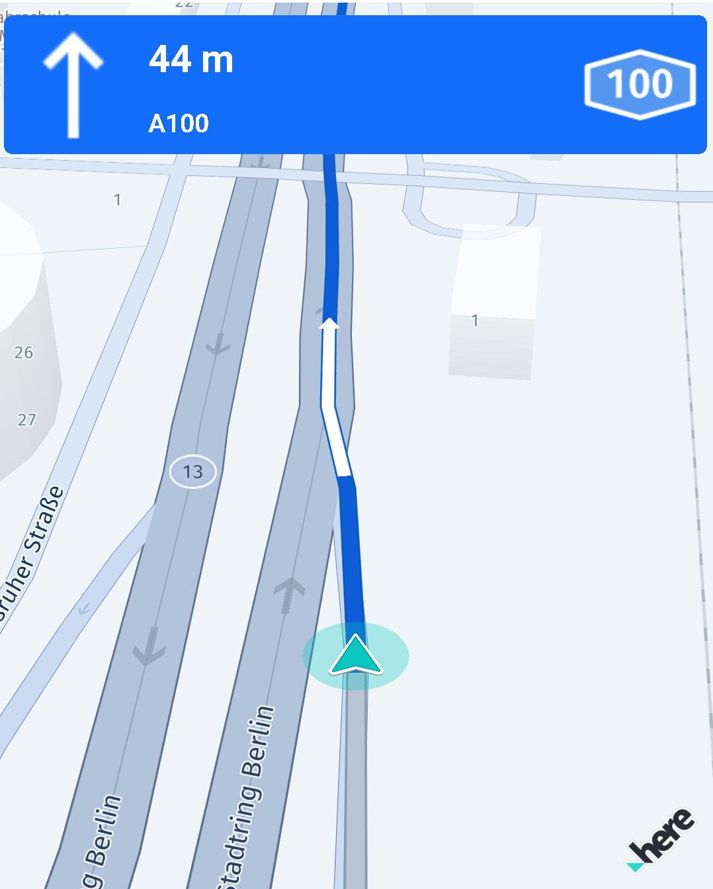
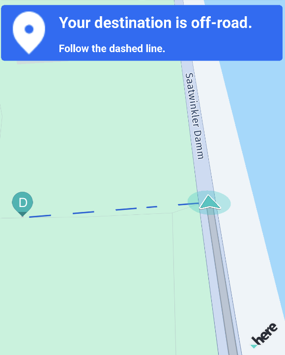

# Optimize navigation

This section explores additional features and customization options that help you tailor the navigation process to meet specific user needs and scenarios, providing a seamless and robust navigation experience.

## Update the map view during navigation

During navigation, whether following a predetermined route or not, it's important to maintain an accurate and informative map view. Key tasks include:

- **Following the current location**: Keep the map centered on the user's current position.
- **Showing a location arrow**: Indicate the user's current direction with an arrow.
- **Rotating the map**: Align the map orientation with the user's current direction.
- **Adding visual assets**: Incorporate additional elements such as maneuver icons for clearer guidance.

You can manage these tasks by either responding to location updates manually or leveraging the `VisualNavigator` to automate these processes.

Each new location event results in a new `NavigableLocation` that holds a map-matched location calculated based on the original GPS signal that we have fed into the `VisualNavigator`. This map-matched location can then be consumed to update the map view.

One caveat, in most cases, getting location updates happens frequently, but nevertheless in discrete steps. This means that between each location may lie a few hundred meters. When updating the camera to the new location, this may cause a little jump.

On the other hand, when using the rendering capabilities of the `VisualNavigator`, you can benefit from smoothly interpolated movements: depending on the speed of the driver, the missing coordinates between two location updates are interpolated and the target map location is automatically updated for you.

In addition, the `VisualNavigator` tilts the map, rotates the map towards the heading direction and shows a 3D location arrow and a `LocationIndicator`. All of this can be activated with one line of code:

```dart
// This enables a navigation view including a rendered navigation arrow.
_visualNavigator.startRendering(_hereMapController);
```

<center><p>
  
  <figcaption>Screenshot: Turn-by-turn navigation example running on a device.</figcaption>
</p></center>

In addition, you can stop following the current location with:

```dart
_visualNavigator.cameraBehavior = null;
```

And enable it again with:

```dart
// Alternatively, use DynamicCameraBehavior to auto-zoom the camera during guidance.
_visualNavigator.cameraBehavior = FixedCameraBehavior();
```

By default, camera tracking is enabled. And thus, the map is always centered on the current location. This can be temporarily disabled to allow the user to pan away manually and to interact with the map during navigation or tracking. The 3D location arrow will then keep moving, but the map will not move. Once the camera tracking mode is enabled again, the map will jump to the current location and smoothly follow the location updates again.

To stop any ongoing navigation, call `_visualNavigator.route = null`.  Reset the above listeners to null or simply call `stop()` on your location provider (depends on the actual implementation of your provider). More information can be found in the [Start and stop guidance](navigation.md#start-and-stop-guidance) section.

For the full source code, please check the corresponding navigation [example app](examples.md).

## Customize the navigation experience

The "navigation_custom_app" example shows how to switch to a custom `LocationIndicator` and to a different type when navigation has stopped. It also shows how the navigation perspective can be customized. Find the example app on [GitHub](https://github.com/heremaps/here-sdk-examples).

- With the `CameraBehavior` you can customize how the map view will look like during guidance. It allows to set an auto-zoom behavior with the `DynamicCameraBehavior` or a static tilt and zoom orientation with the `FixedCameraBehavior` that can be updated programmatically. It allows also other options like changing the principal point. The `SpeedBasedCameraBehavior` also provides customization options and it is the best choice during tracking mode.
- With `ManeuverNotificationOptions` you can specify when TTS voice commands should be forwarded.

With the headless `Navigator`, you get no default or customizable render options - instead, you can render the whole map view on your own - for example, if you want to have bigger route lines or any other visual customization, you can use the general rendering capabilities of the HERE SDK. However, you may also need to implement interpolation - which is already incorporated in the `VisualNavigator`.

When using the `VisualNavigator` you can disable certain render features, like route rendering or showing the default `LocationIndicator`: in order to still render a smooth map experience, you have to take care to update the map view's current target location yourself: a location provider will send new location updates only in discrete steps, which will - even when delivered with a high frequency - lead to a "jumping" map view. Therefore, consider to use the `InterpolatedLocationListener` to get the same smoothened location updates as by default.

### Customize the location indicator

The preconfigured `MapMarker3D` instance can also be customized by setting your own model - or it can be disabled. Internally, the `VisualNavigator` uses a `LocationIndicator` instance and thus you can set also a custom `LocationIndicator` to the `VisualNavigator`. When this is done, you also need to manually add, remove and update the instance. Similar, as when you already use a `LocationIndicator` instance on the map view, see the related [map items](map-items.md) section.

By default, the style of the `LocationIndicator` will be determined from the transport mode that can be set for the `VisualNavigator`. If a route is set, then it is taken from the route instance instead. If a custom asset is used, then the style must be switched directly via the `LocationIndicator` class.

> #### Note
> The "navigation_custom_app" example shows how to switch to a custom `LocationIndicator` and to a different type when navigation has stopped. It also shows how the navigation perspective can be customized.

### Route eat-up

By default, the `VisualNavigator` renders a `Route` with different colors to visually separate the travelled part behind the current location from the part ahead of the user. This can disabled or customized. By default, the same colors are used as for the HERE WeGo mobile application.

If you want to disable the route eat-up visualization, call:

```java
visualNavigator.isRouteProgressVisible = false;
```

Default `VisualNavigatorColors` are available for day & night mode. For example, to switch colors depending on the daytime. The default colors can be customized like shown below:

```dart
void _customizeVisualNavigatorColors() {
  Color routeAheadColor =  Colors.blue;
  Color routeBehindColor = Colors.red;
  Color routeAheadOutlineColor = Colors.yellow;
  Color routeBehindOutlineColor = Colors.grey;
  Color maneuverArrowColor = Colors.green;

  VisualNavigatorColors visualNavigatorColors = VisualNavigatorColors.dayColors();
  RouteProgressColors routeProgressColors = new RouteProgressColors(
      routeAheadColor,
      routeBehindColor,
      routeAheadOutlineColor,
      routeBehindOutlineColor);

  // Sets the color used to draw maneuver arrows.
  visualNavigatorColors.maneuverArrowColor = maneuverArrowColor;
  // Sets route color for a single transport mode. Other modes are kept using defaults.
  visualNavigatorColors.setRouteProgressColors(SectionTransportMode.car, routeProgressColors);
  // Sets the adjusted colors for route progress and maneuver arrows based on the day color scheme.
  _visualNavigator?.colors = visualNavigatorColors;
}
```

Note that this also allows to change the colors of maneuver arrows that are rendered along to path to indicate the next turns.

## Get UI assets

With a few exceptions like for the `VisualNavigator`, the HERE SDK does not provides UI or UI assets for building your own apps - and most guidance information that is available along a route is given as simple data types.

- However, reusable assets for use in your own applications can be found in the MSDKUI open source project from HERE - available on GitHub under this [link](https://github.com/heremaps/msdkui-android/tree/master/MSDKUIKit/MSDKUILib/src/main/res/drawable).

- More reusable icons can be found in the official [HERE Icon Library](https://github.com/heremaps/here-icons).

- On top, you can use a production-ready [reference application](https://github.com/heremaps/here-sdk-ref-app-flutter) that can be used as a base project to start your own app development.

## Adjust the notification frequency

All events, such as `RouteProgress` or the several warning events, are sent in response to a location update. When using the `LocationEngine`, use at least `LocationAccuracy.navigation` for which the update frequency is as close to one second as possible.

Exceptions from this rule are event-driven notifications such as for `RouteDeviation`, `RoadAttributes`, `RoadTexts`, `Milestone`, or `ManeuverViewLaneAssistance` events: after each location update there is a check if such events need to be delivered. Usually, this happens when the attribute changes on the current road.

For some events, the threshold is configurable, such as for maneuver notification texts via `ManeuverNotificationTimingOptions`.

The warning notification distance for warners can be configured as described in [configure notification distances](navigation-warners.md#configure-notification-distances).

## Get waypoint events

The `VisualNavigator` / `Navigator` classes provide more useful notifications. Below is an example of how to receive notifications on passed waypoints. Note that it is possible to be notified at the destination waypoint in two alternative ways:

- The first listener below notifies when the destination is reached - and therefore navigation can be stopped.
- Whereas the second listener shows how to get notified on all types of waypoints including the destination waypoint, but excluding any `passThrough` waypoints.

```dart
// Notifies when the destination of the route is reached.
_visualNavigator.destinationReachedListener = DestinationReachedListener(() {
  // Handle results from onDestinationReached().
  _updateMessageState("Destination reached.");
  // Guidance has stopped. Now consider to, for example,
  // switch to tracking mode or stop rendering or locating or do anything else that may
  // be useful to support your app flow.
  // If the DynamicRoutingEngine was started before, consider to stop it now.
});

// Notifies when a waypoint on the route is reached or missed
_visualNavigator.milestoneStatusListener = MilestoneStatusListener((Milestone milestone, MilestoneStatus milestoneStatus) {
  // Handle results from onMilestoneStatusUpdated().
  if (milestone.waypointIndex != null && milestoneStatus == MilestoneStatus.reached) {
     print('A user-defined waypoint was reached, index of waypoint: ' + milestone.waypointIndex.toString());
     print('Original coordinates: ' + milestone.originalCoordinates.toString());
  } else if (milestone.waypointIndex != null && milestoneStatus == MilestoneStatus.missed) {
     print('A user-defined waypoint was missed, index of waypoint: ' + milestone.waypointIndex.toString());
     print('Original coordinates: ' + milestone.originalCoordinates.toString());
  } else if (milestone.waypointIndex == null && milestoneStatus == MilestoneStatus.reached) {
     // For example, when transport mode changes due to a ferry a system-defined waypoint may have been added.
     print('A system-defined waypoint was reached at: ' + milestone.mapMatchedCoordinates.toString());
  } else if (milestone.waypointIndex == null && milestoneStatus == MilestoneStatus.reached) {
     // For example, when transport mode changes due to a ferry a system-defined waypoint may have been added.
     print('A system-defined waypoint was missed at: ' + milestone.mapMatchedCoordinates.toString());
  }
});
```

The `onMilestoneStatusUpdated()` method provides a `Milestone` instance that contains the information about the passed or missed waypoints along the route. Note that only `stopover` waypoints are included. Also, the destination waypoint is included and any other `stopover` waypoint that was added by a user. In addition, waypoints added by the HERE SDK are included, for example, when there is a need to take a ferry. However, the first waypoint - which is the starting point of your trip - is excluded. Waypoints of type `passThrough` are also excluded.

A `Milestone` includes an index that refers to the waypoint list set by the user when calculating the route. If it is not available, then the `Milestone` refers to a waypoint that was set during the route calculation - for example, when an additional stopover was included by the routing algorithm to indicate that a ferry must be taken.

The `MilestoneStatus` enum indicates if the corresponding `Milestone` has been reached or missed.

## Get road shield icons

With `iconProvider.createRoadShieldIcon(...)` you can asynchronously create a `Bitmap` that depicts a road number such as "A7" or "US-101" - as it already appears on the map view.

The creation of road shield icons happens offline and does not require an internet connection. The data you need to create the icons is taken solely from the `Route` itself, but can be filled out also manually.

<center><p>
  
  <figcaption>Examples of road shield icons.</figcaption>
</p></center>

Below we show how to retrieve the data on-the-fly while following a route. Note that not every road, especially smaller roads, can be visualized by a route shield icon. In general, you can show the icons as part of a route preview before starting guidance or, for example, during guidance for the next maneuver to provide a visual hint where the maneuver takes place.

<center><p>
  
  <figcaption>Showing a road shield together with the next maneuver.</figcaption>
</p></center>

All required information to generate a road shield icon is part of a `Route` object.

The icon itself is generated from `RoadShieldIconProperties` that require parameters such as `RouteType` and `LocalizedRoadNumber`. These parameters can be retrieved from the `Span` of a `Route` object.

Use `span.getShieldText(..)` to get the `shieldText` for use with the `RoadShieldIconProperties`. With `span.getRoadNumbers()` you can get a list of `LocalizedRoadNumber` items with additional information such as `RouteType` (level 1 to 6, indicating whether a road is a major road or not) and `CardinalDirection` (such as in "101 West").

With `IconProvider.IconCallback` you can receive the resulting image - or an error.

> #### Note
> Note that this is a beta release of this feature, so there could be a few bugs and unexpected behaviors. Related APIs may change for new releases without a deprecation process.

## Get map-matched locations

During navigation you can receive map-matched locations with the `NavigableLocationListener`:

```dart
// Notifies on the current map-matched location and other useful information while driving or walking.
// The map-matched location is used to update the map view.
_visualNavigator.navigableLocationListener =
    NavigableLocationListener((NavigableLocation currentNavigableLocation) {
  // Handle results from onNavigableLocationUpdated():
  MapMatchedLocation? mapMatchedLocation = currentNavigableLocation.mapMatchedLocation;
    if (mapMatchedLocation == null) {
    print('This new location could not be map-matched. Are you off-road?');
    return;
  }

  if (mapMatchedLocation?.isDrivingInTheWrongWay == true) {
    // For two-way streets, this value is always false. This feature is supported in tracking mode and when deviating from a route.
    print("This is a one way road. User is driving against the allowed traffic direction.");    
  }

  var speed = currentNavigableLocation.originalLocation.speedInMetersPerSecond;
  var accuracy = currentNavigableLocation.originalLocation.speedAccuracyInMetersPerSecond;
  print("Driving speed (m/s): $speed plus/minus an accuracy of: $accuracy");
});
```

Each provided location update that is fed in from your location source of choice will result in navigable locations that are matched to the road network. Naturally, raw location signals vary across the real location of a device. Map-matching ensures that the raw location is not jumping across the screen. On top, during turn-by-turn navigation, the geometry of the route is taken into account, for example during tunnel extrapolation.

In addition, the event provides the current speed of the user and it indicates if a user is driving into the wrong direction.

## Handle off-road destinations

With off-road guidance you can help customers to reach a destination that lies off-road. Usually, guidance stops at the map-matched destination. A destination is considered to be off-road when it can't be map-matched to a road network - for example, when the destination lies in the middle of a forest.

<center><p>

<figcaption>Screenshot: Off-road guidance.</figcaption>
</p></center>

Note that this feature supports only off-road destinations. If the starting point is off-road, then the nearest map-matched location is used for route calculation as starting point, that is the next road - optionally with access points. If the starting point is too far away from a road network, then route calculation will eventually fail with a `couldNotMatchOrigin` error.

You can detect if the destination is off-road or not and inform the user when the map-matched destination is reached - like shown below:

```dart
// Notifies when the destination of the route is reached.
_visualNavigator.destinationReachedListener = DestinationReachedListener(() {
  Section lastSection = lastCalculatedRoute.sections.last;
  if (lastSection.arrivalPlace.isOffRoad()) {
    print("End of navigable route reached.");
    String message1 = "Your destination is off-road.";
    String message2 = "Follow the dashed line with caution.";
    // Note that for this example we inform the user via UI.
    uiCallback.onManeuverEvent(ManeuverAction.arrive, message1, message2);
  } else {
    print("Destination reached.");
    String distanceText = "0 m";
    String message = "You have reached your destination.";
    uiCallback.onManeuverEvent(ManeuverAction.arrive, distanceText, message);
  }
});
```

For this example, we use on app-side a `uiCallback` mechanism to update our view. This code is not relevant here, so it is omitted.

If the map-matched destination - for example, the road that leads to a forest - is not reached, then a user will get no off-road guidance. Off-road guidance is only started after receiving the `onDestinationReached()` event.

> #### Note
> When off-road events start, then there is no way to go back to the normal guidance mode to receive `RouteProgress` events - unless a new route is set.

Add the following code to provide guidance to the off-road destination:

```dart
// Notifies on the progress when heading towards an off-road destination.
// Off-road progress events will be sent only after the user has reached
// the map-matched destination and the original destination is off-road.
// Note that when a location cannot be map-matched to a road, then it is considered
// to be off-road.
_visualNavigator.offRoadProgressListener = OffRoadProgressListener((offRoadProgress) {
  String distanceText = _convertDistance(offRoadProgress.remainingDistanceInMeters);
  // Bearing of the destination compared to the user's current position.
  // The bearing angle indicates the direction into which the user should walk in order
  // to reach the off-road destination - when the device is held up in north-up direction.
  // For example, when the top of the screen points to true north, then 180° means that
  // the destination lies in south direction. 315° would mean the user has to head north-west, and so on.
  String message = "Direction of your destination: ${offRoadProgress.bearingInDegrees.round()}°";
  uiCallback.onManeuverEvent(ManeuverAction.arrive, distanceText, message);
});

_visualNavigator.offRoadDestinationReachedListener = OffRoadDestinationReachedListener(() {
  print("Off-road destination reached.");
  String distanceText = "0 m";
  String message = "You have reached your off-road destination.";
  uiCallback.onManeuverEvent(ManeuverAction.arrive, distanceText, message);
});
```

For this example, we use on app-side a `_convertDistance()` method to convert distances to meters and kilometers. This code is not relevant for use with the HERE SDK, so its implementation is omitted above.

Note that off-road guidance does not provide help before the user has reached the map-matched destination. Also, there is no support for off-road passages during a trip, for example, when a user deviates from a road or moves on unknown roads. Only when a user reaches the last point of the route that can be reached with the known road network, then off-road guidance is started.

By default, the dashed line that leads to the off-road destination is shown on the map - even if none of the above code is present. This can be controlled like so:

```dart
// Enable off-road visualization (if any) with a dotted straight-line
// between the map-matched and the original destination (which is off-road).
// Note that the color of the dashed line can be customized, if desired.
// The line will not be rendered if the destination is not off-road.
// By default, this is enabled.
_visualNavigator.isOffRoadDestinationVisible = true;
```

> #### Note
> This feature does not guide a user along a path or provides any kind of maneuver information. Please make sure that the provided information is handled with care: only a straight line is drawn from the current location of the user to the off-road destination. In reality, the destination may be unreachable or may lie in dangerous territory that is impossible to be travelled by pedestrians. Make sure to notify your users accordingly.
>
> If a device supports compass data, an application can decide to improve the user experience, so that the device can be rotated to match the off-road visualization - which is only given in form of a dashed line to the destination. Note that such a compass feature would be a pure app-side implementation, as the HERE SDK does not provide support for this.

## Find better routes

Use the `DynamicRoutingEngine` to periodically request optimized routes based on the current traffic situation. This engine searches for new routes that are faster (based on ETA) than the current route you are driving on.

The `DynamicRoutingEngine` requires an online connection and a `RouteHandle`. When trying to search for a better route offline or when the `RouteHandle` is not enabled, a routing error is propagated:

```dart
// Enable route handle.
var routingOptions = HERE.CarOptions();
routingOptions.routeOptions.enableRouteHandle = true;
```

By setting `DynamicRoutingEngineOptions`, you can define the `minTimeDifference` before getting notified on a better route. The `minTimeDifference` is compared to the remaining ETA of the currently set route. The `DynamicRoutingEngineOptions` also allow to set a `pollInterval` to determine how often the engine should search for better routes:

```dart
void _createDynamicRoutingEngine() {
  var dynamicRoutingOptions = DynamicRoutingEngineOptions();
  // Both, minTimeDifference and minTimeDifferencePercentage, will be checked:
  // When the poll interval is reached, the smaller difference will win.
  dynamicRoutingOptions.minTimeDifference = Duration(seconds: 1);
  dynamicRoutingOptions.minTimeDifferencePercentage = 0.1;
  // Below, we use 10 minutes. A common range is between 5 and 15 minutes.
  dynamicRoutingOptions.pollInterval = Duration(minutes: 10);

  try {
    // With the dynamic routing engine you can poll the HERE backend services to search for routes with less traffic.
    // This can happen during guidance - or you can periodically update a route that is shown in a route planner.
    //
    // Make sure to call dynamicRoutingEngine.updateCurrentLocation(...) to trigger execution. If this is not called,
    // no events will be delivered even if the next poll interval has been reached.
    _dynamicRoutingEngine = DynamicRoutingEngine(dynamicRoutingOptions);
  } on InstantiationException {
    throw Exception("Initialization of DynamicRoutingEngine failed.");
  }
}
```

Note that by setting a `minTimeDifference` of 0, you will get no events. The same applies for `minTimeDifferencePercentage`. Make sure to set a value >= 0 in order to get events.

> #### Note
> The `DynamicRoutingEngine` initiates periodic calls to the HERE Routing backend. Depending on your contract, each call may be charged separately. It is the application's responsibility to decide how often this code should be executed.

When receiving a better route, the difference to the original `route` is provided in meters and seconds:

```dart
void _startDynamicSearchForBetterRoutes(HERE.Route route) {
  try {
    // Note that the engine will be internally stopped, if it was started before.
    // Therefore, it is not necessary to stop the engine before starting it again.
    _dynamicRoutingEngine.start(
        route,
        // Notifies on traffic-optimized routes that are considered better than the current route.
        DynamicRoutingListener((Route newRoute, int etaDifferenceInSeconds, int distanceDifferenceInMeters) {
          print('DynamicRoutingEngine: Calculated a new route.');
          print('DynamicRoutingEngine: etaDifferenceInSeconds: $etaDifferenceInSeconds.');
          print('DynamicRoutingEngine: distanceDifferenceInMeters: $distanceDifferenceInMeters.');

          // An implementation needs to decide when to switch to the new route based
          // on above criteria.
        }, (RoutingError routingError) {
          final error = routingError.toString();
          print('Error while dynamically searching for a better route: $error');
        }));
  } on DynamicRoutingEngineStartException {
    throw Exception("Start of DynamicRoutingEngine failed. Is the RouteHandle missing?");
  }
}
```

Based on the provided `etaDifferenceInSeconds` and `distanceDifferenceInMeters` in comparison to the current route, an application can decide if the `newRoute` should be used. If so, it can be set to the `Navigator` or `VisualNavigator` at any time.

> #### Note
> Note that the `DynamicRoutingEngine` will not be aware of newly set routes: that means, if you are detecting a route deviation and try to calculate a new route in parallel, for example, by calling `routingEngine.returnToRoute(...)`, then you need to inform the `DynamicRoutingEngine` after a new route is set to the `navigator` instance. In order to do so, call `stop()` and then `start(...)` on the `dynamicRoutingEngine` instance to start it again with the new route. This can be done right after the route was set to the `navigator` - outside of the `onBetterRouteFound()` callback. The `RouteDeviation` event allows you to calculate how far a user has deviated from a route (see [Return to a Route After Deviation](navigation-deviation.md#return-to-a-route-after-deviation)).

For simplicity, the recommended flow to set new routes looks like this:

1. Decide if a new route should be set.
2. If yes, stop the `DynamicRoutingEngine`.
3. Set the new route: `navigator.route = newRoute`.
4. Start the `DynamicRoutingEngine` with the new route.

Make sure to call these steps outside of the `onBetterRouteFound()` event: use a local flag and follow the above steps when receiving a new location update - for example, before calling `dynamicRoutingEngine.updateCurrentLocation(..)`, see below.

Note that passing a new route during guidance can have an impact on the user experience - it is recommended, to inform users about the change. And it is also recommended to let a user define the criteria upfront. For example, not any `etaDifferenceInSeconds` may justify to follow a new route.

> #### Note
> Although the `DynamicRoutingEngine` can be used to update traffic information and ETA periodically, there is no guarantee that the new route is not different. In addition, the `DynamicRoutingEngine` informs on `distanceDifferenceInMeters` - but an unchanged route length does not necessarily mean that the route shape is the same. However, if only the ETA has changed and length is the same, then it is likely that only the ETA got updated due to an updated traffic situation: if it is crucial for you to stay on the original route, you need to compare the coordinates of the route shape - or consider to calculate a new route on your own with `routingEngine.refreshRoute()`. Calling `refreshRoute()` will not change the route shape. See [Routing](routing.md) section for more details. In opposition, keep in mind that the intended use of the `DynamicRoutingEngine` is to find better routes and for this it is most often desired to follow a new route shape to bypass any traffic obstacles. Also, a better route can only be found when traffic obstacles are present (or gone) in the route ahead.

Make sure to update the last map-matched location of the driver and set it to the `DynamicRoutingEngine` as soon as you get it - for example, as part of the `RouteProgress` or `NavigableLocation` update. This is important, so that a better route always starts close to the current location of the driver.

```dart
_dynamicRoutingEngine.updateCurrentLocation(_lastMapMatchedLocation!, routeProgress.sectionIndex);
```

The `DynamicRoutingEngine` requires a map matched location that lies on the route. If the user has deviated from the route, then you will receive a `RoutingError.couldNotMatchOrigin`.

The `lastMapMatchedLocation` you can get from the `NavigableLocationListener` and `sectionIndex` from the `RouteProgressListener`. It is recommended to call `updateCurrentLocation()` when receiving events from the `RouteProgressListener`.

Note that after reaching the destination, the engine will not be automatically stopped from running. Therefore, it is recommended to call `stop()` when the engine is no longer needed.

An example implementation for this can be found in the corresponding navigation [example app](examples.md).

## Update traffic information

It is crucial to provide updated arrival times (ETA) including traffic delay time and to inform on traffic obstacles ahead of the current route. How to update traffic information on your trip?

There can be two scenarios:

- Stay on the existing route: In this case, use the `RoutingEngine` to call `refreshRoute()` periodically.
- Find better route alternatives to bypass traffic obstacles: Use the `DynamicRouteEngine`. If users should follow the new `Route`, you need to set it to the `Navigator` or `VisualNavigator` instance.

You can take the updated ETA, traffic delay and traffic jam information directly from the `Route` object.

Note that traffic visualization on the route itself is supported when you render the route polyline on your own. You can find an example for this in the [Routing](routing-ui.md) section. This section also explains how to extract traffic information from a `Route` object.

> #### Note
> Alternatively, you can enable the [traffic flow layer](traffic.md) on the map. With the default settings of the `VisualNavigator`, the traffic flow lines will still be visible besides the route polyline on any zoom level. For example, the [HERE WeGo](https://www.here.com/products/wego) application uses this approach to visualize the current traffic situation.

## Use prefetched data

You can prepare a trip with prefetched data that is dynamically loaded into the map cache.

This allows to improve the user experience - for example, during turn-by-turn navigation to handle temporary network losses gracefully. More on this feature can be found in the [prefetching section](offline-maps-options.md#prefetch-map-data).

## Navigate offline

Almost all navigation features work also without an internet connection when [offline map](offline-maps.md) data has been cached, installed or preloaded: only a few features require an online connection, for example, when using the `DynamicRouteEngine` to search online for traffic-optimized routes.

Unlike for other engines, the `VisualNavigator` or the `Navigator` will automatically try to download online data when reaching regions that have not been cached, installed or preloaded beforehand. And vice versa, both components will make use of offline map data when it is available on a device - even if an online connection is available.

## Navigate tunnels

The HERE SDK uses road map-matching and the base speed limit for the current road segment to automatically estimate the location of your vehicle inside a tunnel. With turn-by-turn navigation also the route path is used. This happens only when no strong enough GPS signal is perceived. If a vehicle needs to stop in a tunnel due to a traffic jam, then it may happen that the location arrow would still move forward, because the visualized location is only estimated.

- The `NavigableLocation` event in a tunnel will contain the estimated `Location`, but its time stamp and speed properties will be `null` intentionally to not provide misleading information.
- The estimated `Location` is also accessible through the `InterpolatedLocationListener`. This listener can be useful even outside of a tunnel, as it continuously provides a calculated location between the discrete GPS signals that are fed in. This listener can be useful when you want to know which location is used by the `VisualNavigator` to render the `LocationIndicator` - or when you want to render it on your own. Usually, location updates arrive with a frequency of 1 Hz. This frequency is too low to achieve a smooth animation as usually the map view is rendered with 60 Hz. Note that the frame rate can be adjusted for the `MapView` - in that case, also the `InterpolatedLocationListener` will be adjusted accordingly.

An application can detect if (and which) `Location` updates are fed into the `Navigator` or `VisualNavigator`, but as of now there is no API that helps to precisely determine if a `NavigableLocation` is estimated or not.

It is also possible to disable tunnel extrapolation. By default, tunnel extrapolation is enabled. Use the `isEnableTunnelExtrapolation` property with the `Navigator` and `VisualNavigator` to change this.

Note that with the `isExtrapolationEnabled` property you can control whether to enable or disable extrapolation logic for location updates. By default, this is enabled. This feature is useful to mitigate issues with a lagging `LocationIndicator` and it can be used independent from tunnels.
