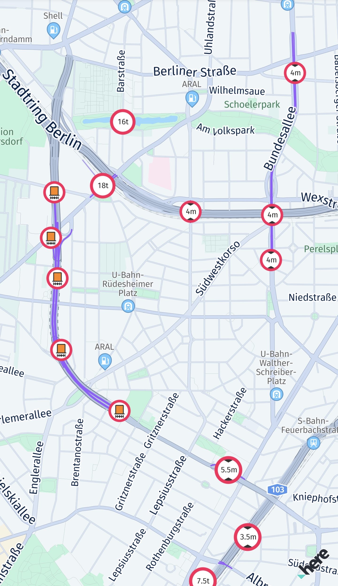

# Navigate trucks

The HERE SDK supports truck routing and guidance with a variety of features. For example, during navigation you can attach a listener to get notified on truck restrictions ahead, such as narrow tunnels. Other examples of possible restrictions can be bridges that are not high enough to be passed by a bigger truck or roads where the weight of the truck is beyond the permissible weight of the road.

See the following code snippet:

```dart
// Notifies truck drivers on road restrictions ahead. Called whenever there is a change.
_visualNavigator.truckRestrictionsWarningListener =
    TruckRestrictionsWarningListener((List<TruckRestrictionWarning> list) {
  // The list is guaranteed to be non-empty.
  for (TruckRestrictionWarning truckRestrictionWarning in list) {
    if (truckRestrictionWarning.distanceType == DistanceType.ahead) {
      print("TruckRestrictionWarning ahead in: ${truckRestrictionWarning.distanceInMeters} meters.");
      if (truckRestrictionWarning.timeRule != null && !truckRestrictionWarning.timeRule!.appliesTo(DateTime.now())) {
        // For example, during a specific time period of a day, some truck restriction warnings do not apply.
        // If truckRestrictionWarning.timeRule is null, the warning applies at anytime.
        print("Note that this truck restriction warning currently does not apply.");
      }
    } else if (truckRestrictionWarning.distanceType == DistanceType.reached) {
      print("A restriction has been reached.");
    } else if (truckRestrictionWarning.distanceType == DistanceType.passed) {
      // If not preceded by a "reached"-notification, this restriction was valid only for the passed location.
      print("A restriction just passed.");
    }

    // One of the following restrictions applies ahead, if more restrictions apply at the same time,
    // they are part of another TruckRestrictionWarning element contained in the list.
    if (truckRestrictionWarning.weightRestriction != null) {
      WeightRestrictionType type = truckRestrictionWarning.weightRestriction!.type;
      int value = truckRestrictionWarning.weightRestriction!.valueInKilograms;
      print("TruckRestriction for weight (kg): ${type.toString()}: $value");
    } else if (truckRestrictionWarning.dimensionRestriction != null) {
      // Can be either a length, width or height restriction of the truck. For example, a height
      // restriction can apply for a tunnel. Other possible restrictions are delivered in
      // separate TruckRestrictionWarning objects contained in the list, if any.
      DimensionRestrictionType type = truckRestrictionWarning.dimensionRestriction!.type;
      int value = truckRestrictionWarning.dimensionRestriction!.valueInCentimeters;
      print("TruckRestriction for dimension: ${type.toString()}: $value");
    } else {
      print("TruckRestriction: General restriction - no trucks allowed.");
    }
  }
});
```

The `DistanceType.reached` notifies when a truck restriction has been reached. The event is followed by `passed`, when the restriction has been passed. If the restriction has no length, then `reached` is skipped and only a `passed` event is sent. Note that the `ahead` event is always sent first.

Note that a restriction for each distance type is exactly given only one time. If you want to continuously notify a driver with updated distance information, you can do so, by tracking the `RouteProgress` which includes a frequent distance update to the destination.

If all restrictions are nil, then a general truck restriction applies. The type of the restriction can be also seen from the `TruckRestrictionWarningType`.

When comparing the restriction warnings with the `MapFeatures.vehicleRestrictions` layer on the map, note that some restrictions may be valid only for one direction of a road.

> #### Note
> When guidance is stopped by setting a null route or a new route, then any restriction that was announced with an `ahead` notification, will instantly result in a `passed` event to clear pending restriction warnings. While following a route - any restriction that lies not on the route is filtered out, but as soon as a driver deviates far enough (more than 15 meters) from a route, then supported restrictions ahead on the current road will lead again to restriction warnings.

The notification thresholds for truck restrictions differ slightly from other warners, find the thresholds listed [here](navigation-optimization.md#adjust-the-notification-frequency).

The `TruckRestrictionWarning` event is based on the map data of the road network ahead. It delivers restrictions regardless of the currently set `TransportMode`.

> #### Note
> When calculating a route, you can specify `TruckOptions` including `TruckSpecifications`. This may have an influence on the resulting `Route`. However, it does not influence the `TruckRestrictionWarning` event: most restrictions found in the map data ahead are forwarded. Therefore, it may make sense for an application to filter out restriction warnings that are not relevant for the current vehicle. Note that this event is also delivering events in tracking mode when there is no route to follow.

More details on truck routing are given in the [routing](routing.md) section. For example, there you can find how to calculate a route specifically for trucks. In general, if a route contains the `Truck` transportation type, it is optimized for trucks.

In addition, you can specify several avoidance options, for example, to exclude certain city areas. All this can be specified before the route gets calculated and passed into the `Navigator` or `VisualNavigator`.

Worth to mention are also the following features:

- You can specify vehicle restrictions such as truck dimensions or if a truck is carrying hazardous goods via `TruckOptions` that can contain `TruckSpecifications` and `HazardousGood` lists. With this information you can shape the truck route. To get notified on upcoming truck restrictions, listen to the `TruckRestrictionWarning` event as shown above.
- You can listen for certain `RoadAttributes` as explained [above](navigation-warners.md#get-road-attribute-changes).
- When transport mode is set to `truck`, `SpeedLimit` events will indicate the commercial vehicle regulated (CVR) speed limits that may be lower than for cars. Consider to specify also the `TruckSpecifications` inside the `RouteOptions` when calculating the route. For tracking mode, call `navigator.trackingTransportProfile(vehicleProfile)` and set a `VehicleProfile` with `truck` transport mode. By default, for tracking, `car` is assumed: Make sure to specify other vehicle properties like weight according to your truck.
- Worth to mention, `grossWeightInKilograms` and `weightInKilograms` will effect CVR speed limits, as well as route restrictions and the estimated arrival time. Without setting proper `TruckSpecifications`, routes and notifications may be inappropriate.
- You can exclude emission zones to not pollute the air in sensible inner city areas via `AvoidanceOptions`. With this you can also avoid certain `RoadFeatures` like tunnels. Those can be set via `TruckOptions` and are then excluded from route calculation.
- You can enable a map layer scheme that shows safety camera icons on the map: `MapSceneLayers.safetyCameras`. Note: This layer is also suitable for cars.
- You can enable a map layer scheme that is optimized to show truck-specific information on the map: `MapScene.Layers.vehicleRestrictions`. It offers several `MapFeatureModes`, for example, to highlight active and inactive restrictions as purple lines on an affected road - a gray line or a gray icon means that the restriction is inactive. If a road is crossing such a purple line - and the road itself is not indicated as purple - then this restriction does not apply on the current road. Note that an icon does not necessarily indicate an exact location: For example, in case of a restricted road an icon may be placed centered on the restricted road - or, if the restriction is longer, the icon may be repeated several times for the same restriction along one or several roads. The icon itself is localized per country and represents the type of restriction. For most restrictions, the location and the type of the restriction is also indicated through the `TruckRestrictionWarning` event (as shown above).
- Use `TruckAmenities` which contains information on showers or rest rooms in the `Details` of a `Place`. Search along a route corridor and check if a place contains truck amenities. For online use, obtaining `TruckAmenities` requires enabling the closed-alpha feature by calling `searchEngine.setCustomOption()` with `"show"` as `name` and `"truck"` as `value`. Additionally, an extra license is required. For use with the `OfflineSearchEngine` (if available for your edition), no license is required. Please [contact us](https://www.here.com/contact) to receive online access. If your credentials are not enabled, a `SearchError.forbidden` error will indicate the missing license.

<center><p>

<figcaption>MapSceneLayers.vehicleRestrictions</figcaption>
</p></center>
