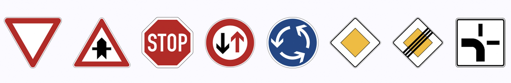
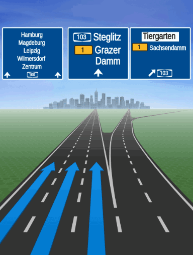

# Stay aware with warners

The `Navigator` and the `VisualNavigator` offer an extended warner system that allows you to receive notifications for certain events during tracking or during turn-by-turn navigation. Warners help you to drive safely or to receive information that may be useful to know in advance.

Note that not all warners alert on dangerous situations - many warners serve informational purposes such as knowing the current road attributes.

The most common warning events are:

- `TruckRestrictionWarning`: Notifies on upcoming truck obstacles that violate the set truck specifications (such as height or weight), or when trucks are not allowed to pass.
- `SafetyCameraWarning`: Notifies on upcoming safety spots (radar speed cameras).
- `SpeedLimit`: Receive a notification when the speed limit of the current road changes.
- `SpeedWarningStatus`: Notifies when the speed limit is exceeded.
- `SchoolZoneWarning`: A warning which notifies about a school zone presence on a road ahead where the speed limit is lower than the default speed limit on that road.
- `BorderCrossingWarning`: Notifies when country borders or states within a country are approached. Notifies also on the general speed limits that apply in the country or state.
- `RailwayCrossingWarning`: Notifies on upcoming railway crossings.
- `EnvironmentalZoneWarning`: Notifies when emission zones are approached.
- `DangerZoneWarning`: Notifies when a danger zone is approached that requires the attention of a driver.
- `LowSpeedZoneWarning`: Notifies when a low speed zone is approached that requires the attention of a driver.
- `TollStop`: Notifies on upcoming toll stops and which lane to take to reach a toll booth.
- `RealisticViewWarning`: Provides SVG content to show an upcoming junction with signposts.
- `RoadSignWarning`: Notifies on upcoming traffic signs, such as stop signs.
- `RoadAttributes`: Notifies when the current road attributes change, for example, when reaching a tunnel, a bridge or a toll way.
- `ManeuverViewLaneAssistance`: Provides a list of `Lane` recommendations if the next route maneuver takes place at a junction - regardless if the junction is considered complex or not.
- `JunctionViewLaneAssistance`: Provides a list of `Lane` recommendations only for complex junctions - regardless if a maneuver takes place at the junction or not. This event is not delivered for non-complex junctions.
- `CurrentSituationLaneView`: Receive lane-based information on the access, type and direction of the lanes of the current road a user is driving on.

## Configure notification distances

By default, the notification distances for emitting warnings for each `WarningType` are configured as follows:

 - `warningNotificationDistances.slowSpeedDistanceInMeters`: For roads in urban areas where a slow driving speed is expected, the event is sent 500 meters ahead, by default.
 - `warningNotificationDistances.regularSpeedDistanceInMeters`: For roads in rural areas where a regular driving speed is expected, the event is sent 750 meters ahead, by default.
 - `warningNotificationDistances.fastSpeedDistanceInMeters`: For roads such as highways where a higher driving speed is expected, the event is sent 1000 meters in advance by default.

 > #### Note
 > The `TimingProfile` defines the speed ranges categorized as fast, regular, and slow.

Distances for emitting warnings can be configured using `VisualNavigator`. This is achieved by calling `visualNavigator.setWarningNotificationDistances(..)`, which accepts a specified `WarningType` and an instance of `WarningNotificationDistances`. The example below shows how the notification distances for `RoadSignWarning` can be set:

```dart
// Get notification distances for road sign alerts from visual navigator.
WarningNotificationDistances warningNotificationDistances = _visualNavigator.getWarningNotificationDistances(WarningType.roadSign);

// The distance in meters for emitting warnings when the speed limit or current speed is fast. Defaults to 1500.
warningNotificationDistances.fastSpeedDistanceInMeters = 1600;
// The distance in meters for emitting warnings when the speed limit or current speed is regular. Defaults to 750.
warningNotificationDistances.regularSpeedDistanceInMeters = 800;
// The distance in meters for emitting warnings when the speed limit or current speed is slow. Defaults to 500.
warningNotificationDistances.slowSpeedDistanceInMeters = 600;

// Set the warning distances for road signs.
_visualNavigator.setWarningNotificationDistances(WarningType.roadSign, warningNotificationDistances);
```

> #### Note
> The `WarningNotificationDistances` apply only to warners that alert about specific locations or areas along the route. It does not impact the `SpeedLimitListener`, which is independent of location and activates when the speed limit is exceeded or returns to within limits.

For most warners, the notification threshold is configurable, here you can find more information: [notification frequency](navigation-optimization.md#adjust-the-notification-frequency).

> #### Note
> All warners are supported during tracking mode. This means that you will get events for each warning type also when driving freely around - without following a particular route or after a destination has been reached.

In addition, all warners are not specific for a route or the set `RouteOptions` - unless explicitly mentioned (like for [truck speed limits](navigation-warners.md#get-speed-limit-warnings)). For example, you may receive `TruckRestrictionWarning` events while following a pedestrian route - if you wish so. In general, warner events are generated based on the map-matched location fed into the navigator. For example, pedestrian routes are most often map-matched to the same side of the road as for other transport modes ignoring sideways due to the precision of the GPS signal.

> #### Note
> Sometimes an application may want to warn on certain danger spots. For example, to display the distance to an obstacle that is ahead of a vehicle. For such cases consider to use the convenient method `navigator.calculateRemainingDistanceInMeters​(GeoCoordinates coordinates)` which provides the distance between the current location of the user on the route and the given `coordinates` - if they are on the route ahead. If the `coordinates` are already behind or not on the route at all, `null` is returned. Note that this method requires that the app knows the `coordinates` of the spot ahead in question.


Find more information on each warner in the sections below.

## Get speed limit warnings

By implementing the `SpeedLimitListener` you can receive events on the speed limits that are available along a road. These can be the speed limits as indicated on the local signs, as well as warnings on special speed situations, like for example, speed limits that are only valid for specific weather conditions.

Speed limits that are marked as conditional may be time-dependent. For example, speed limits for school zones can be valid only for a specific time of the day. In this case, the HERE SDK compares the device time with the time range of the speed limit. If the speed limit is currently valid, it will be propagated as event, otherwise not.

An implementation example can be found in the "navigation_app" example you can find on [GitHub](https://github.com/heremaps/here-sdk-examples):

```dart
// Notifies on the current speed limit valid on the current road.
_visualNavigator.speedLimitListener = SpeedLimitListener((SpeedLimit speedLimit) {
  // Handle results from onSpeedLimitUpdated().
  double? currentSpeedLimit = _getCurrentSpeedLimit(speedLimit);

  if (currentSpeedLimit == null) {
    print("Warning: Speed limits unknown, data could not be retrieved.");
  } else if (currentSpeedLimit == 0) {
    print("No speed limits on this road! Drive as fast as you feel safe ...");
  } else {
    print("Current speed limit (m/s): $currentSpeedLimit");
  }
});

double? _getCurrentSpeedLimit(SpeedLimit speedLimit) {
  // Note that all speedLimit properties can be null if no data is available.

  // The regular speed limit if available. In case of unbounded speed limit, the value is zero.
  print("speedLimitInMetersPerSecond: " + speedLimit.speedLimitInMetersPerSecond.toString());

  // A conditional school zone speed limit as indicated on the local road signs.
  print("schoolZoneSpeedLimitInMetersPerSecond: " + speedLimit.schoolZoneSpeedLimitInMetersPerSecond.toString());

  // A conditional time-dependent speed limit as indicated on the local road signs.
  // It is in effect considering the current local time provided by the device's clock.
  print("timeDependentSpeedLimitInMetersPerSecond: " + speedLimit.timeDependentSpeedLimitInMetersPerSecond.toString());

  // A conditional non-legal speed limit that recommends a lower speed,
  // for example, due to bad road conditions.
  print("advisorySpeedLimitInMetersPerSecond: " + speedLimit.advisorySpeedLimitInMetersPerSecond.toString());

  // A weather-dependent speed limit as indicated on the local road signs.
  // The HERE SDK cannot detect the current weather condition, so a driver must decide
  // based on the situation if this speed limit applies.
  print("fogSpeedLimitInMetersPerSecond: " + speedLimit.fogSpeedLimitInMetersPerSecond.toString());
  print("rainSpeedLimitInMetersPerSecond: " + speedLimit.rainSpeedLimitInMetersPerSecond.toString());
  print("snowSpeedLimitInMetersPerSecond: " + speedLimit.snowSpeedLimitInMetersPerSecond.toString());

  // For convenience, this returns the effective (lowest) speed limit between
  // - speedLimitInMetersPerSecond
  // - schoolZoneSpeedLimitInMetersPerSecond
  // - timeDependentSpeedLimitInMetersPerSecond
  return speedLimit.effectiveSpeedLimitInMetersPerSecond();
}
```

Note that speed limits depend on the specified transport mode. Currently, the HERE SDK differentiates for cars and trucks based on the legal commercial vehicle regulations per country (CVR). That means, the above `SpeedLimit` event can indicate a lower speed limit for trucks: for example, on a highway, the speed limit will be at most [80 km/h in Germany](https://ec.europa.eu/transport/road_safety/going_abroad/germany/speed_limits_en.htm) - while for cars there may be a speed limit indicated that is 130 km/h or higher. Use map version 32 or higher to get CVR speed limits. On lower map versions trucks will receive the same speed limits as cars. Note that the map version can be updated with the `MapUpdater` - even if there are no downloaded regions - as navigation will only request the map data of the same version that is currently stored into the map cache. Therefore, keep in mind that this applies to both, online and offline usage.

> #### Note
> For trucks, we recommend to also specify the `TruckSpecifications` inside the `RouteOptions`. The property `grossWeightInKilograms` can have an impact on the speed limit for trucks. For most countries this has an impact on the legally allowed speed limit. If no weight is set, only the legally highest allowed speed limits for trucks will be forwarded - as the HERE SDK will then assume the truck's weight is very low. Speed limits for trucks are determined according to the local commercial vehicle regulations (CVR). Note that some countries like Japan regulate this different. However, routes calculated for trucks will not deliver speed limits suitable for cars - for example, if your truck's weight is below 3.5 T, consider to calculate a car route instead.

For tracking mode, call `navigator.trackingTransportProfile(vehicleProfile)` and set a `VehicleProfile` with e.g. `truck` transport mode if you are a truck driver - make sure to specify also other vehicle properties like weight according to your vehicle. Setting this profile will determine `speedLimit.effectiveSpeedLimitInMetersPerSecond()`, but it will not affect the regular speed limit (`speedLimit.speedLimitInMetersPerSecond`).

> #### Note
> For routes in **Japan**, you can set the special flag `isLightTruck` via `TruckSpecifications`. This flag indicates whether the truck is light enough to be classified as a car. The flag should not be used in countries other than Japan. Note that this is a beta release of this feature.

## Get overspeed warnings

Although you can detect when you exceed speed limits yourself when you receive a new speed limit event (see above), there is a more convenient solution that can help you implement a speed warning feature for your app.

> #### Note
> This does not warn when temporary speed limits such as weather-dependent speed limits are exceeded.

The `onSpeedWarningStatusChanged()` method will notify as soon as the driver exceeds the current speed limit allowed. It will also notify as soon as the driver is driving slower again after exceeding the speed limit:

```dart
// Notifies when the current speed limit is exceeded.
_visualNavigator.speedWarningListener = SpeedWarningListener((SpeedWarningStatus speedWarningStatus) {
  // Handle results from onSpeedWarningStatusChanged().
  if (speedWarningStatus == SpeedWarningStatus.speedLimitExceeded) {
    // Driver is faster than current speed limit (plus an optional offset, see _setupSpeedWarnings()).
    // Play a click sound to indicate this to the driver.
    // As Flutter itself does not provide support for sounds,
    // alternatively use a third-party plugin to play an alert sound of your choice.
    // Note that this may not include temporary special speed limits, see SpeedLimitListener.
    SystemSound.play(SystemSoundType.click);
    print('Speed limit exceeded.');
  }

  if (speedWarningStatus == SpeedWarningStatus.speedLimitRestored) {
    print('Driver is again slower than current speed limit (plus an optional offset.)');
  }
});
```

> #### Note
> Note that `lambda_onSpeedWarningStatusChanged()` does not notify when there is no speed limit data available. This information is only available as part of a `NavigableLocation` instance.

A `SpeedWarningStatus` is only delivered once the current speed is exceeded or when it is restored again - for example, when a driver is constantly driving too fast, only one event is fired.

The `lambda_onSpeedWarningStatusChanged()` notification is dependent on the current road's speed limits and the driver's speed. This means that you can get speed warning events also in tracking mode independent of a route. And, consequently, you can receive a `speedLimitRestored` event when the route has changed - after driver's speed slows again.

Optionally, you can define an offset that is added to the speed limit value. You will be notified only when you exceed the speed limit, including the offset. Below, we define two offsets, one for lower and one for higher speed limits. The boundary is defined by `highSpeedBoundaryInMetersPerSecond`:

```dart
void _setupSpeedWarnings() {
  SpeedLimitOffset speedLimitOffset = SpeedLimitOffset();
  speedLimitOffset.lowSpeedOffsetInMetersPerSecond = 2;
  speedLimitOffset.highSpeedOffsetInMetersPerSecond = 4;
  speedLimitOffset.highSpeedBoundaryInMetersPerSecond = 25;

  _visualNavigator.speedWarningOptions = SpeedWarningOptions(speedLimitOffset);
}
```

Here we set the `highSpeedBoundaryInMetersPerSecond` to 25 m/s: if a speed limit sign is showing a value above 25 m/s, the offset used is `highSpeedOffsetInMetersPerSecond`. If it is below 25 m/s, the offset used is `lowSpeedOffsetInMetersPerSecond`.

For the example values used above,

- if the speed limit on the road is 27 m/s, the (high) speed offset used is 4 m/s. This means we will only receive a warning notification when we are driving above 31 m/s = 27 m/s + 4 m/s. The `highSpeedOffsetInMetersPerSecond` is used, as the current speed limit is greater than `highSpeedBoundaryInMetersPerSecond`.

- if the speed limit on the road is 20 m/s, the (low) speed offset used is 2 m/s. This means we will only receive a warning notification when we are driving above 22 m/s = 20 m/s + 2 m/s. The `lowSpeedOffsetInMetersPerSecond` is used, as the current speed limit is smaller than `highSpeedBoundaryInMetersPerSecond`.

You can also set negative offset values. This may be useful if you want to make sure you never exceed the speed limit by having a buffer before you reach the limit. Note that you will never get notifications when you drive  too slow, for example, slower than a defined offset - unless a previous speed warning has been restored.

> #### Note
> Regarding the vehicle specifications, the same rules apply as mentioned above for speed limits.

## Get road sign warnings

Along a road you can find many shields. While driving you can receive detailed notifications on these shields by setting a `RoadSignWarningListener`.

The resulting `RoadSignWarning` event contains information on the shield, including information such as `RoadSignType` and `RoadSignCategory`.

Note that the actual road sign icons are `not` provided by the HERE SDK - this event delivers only information on the type of the sign, but no visuals of the sign itself. Also, the exact location of the traffic sign is not provided - however, since the ahead-distance information is provided, an application can notify when the sign is reached: for example, the `RouteProgress` event delivers constantly information about the travelled distance of a vehicle.

By default, the event will be fired with the same distance threshold as for other warners:

- On highways, the event is fired approximately 2000 meters ahead.
- On rural roads, the event is fired approximately 1500 meters ahead.
- In cities, the event is fired approximately 1000 meters ahead.

With `RoadSignWarningOptions` you can set a filter on which shields you want to get notified.

<center><p>
  
  <figcaption>Some examples of priority road signs (not included in the HERE SDK).</figcaption>
</p></center>

Note that not all road shields are included. `RoadSignType` lists all supported types. For example, road signs showing speed limits are excluded, as these shields can be detected with the dedicated `SpeedLimitListener`.

The below code snippet shows a usage example:

```dart
RoadSignWarningOptions roadSignWarningOptions = new RoadSignWarningOptions();
// Set a filter to get only shields relevant for trucks and heavyTrucks.
roadSignWarningOptions.vehicleTypesFilter = [RoadSignVehicleType.trucks, RoadSignVehicleType.heavyTrucks];
_visualNavigator.roadSignWarningOptions = roadSignWarningOptions;

// Notifies on road shields as they appear along the road.
_visualNavigator.roadSignWarningListener = RoadSignWarningListener((RoadSignWarning roadSignWarning) {
  print("Road sign distance (m): ${roadSignWarning.distanceToRoadSignInMeters}");
  print("Road sign type: ${roadSignWarning.type.name}");

  if (roadSignWarning.signValue != null) {
    // Optional text as it is printed on the local road sign.
    print("Road sign text: ${roadSignWarning.signValue!.text}");
  }

  // For more road sign attributes, please check the API Reference.
});
```

`RoadSignWarning` events are issued exactly two times:

- When `DistanceType` is `AHEAD` and `distanceToRoadSignInMeters` is > 0.
- When `DistanceType` is `PASSED` and `distanceToRoadSignInMeters` is 0.

> #### Note
> For positional warners that notify on a singular object along a road, such as a safety camera, a road sign or a realistic view, there is always only one active warning happening at a time: this means that after each `ahead` event always a `passed` event will follow to avoid cases where two `ahead` warnings for a single object are active at the same time.

## Get toll collection point warnings

Another warner type is the `TollStopWarningListener` that provides events on upcoming toll booths.

This includes also information on payment details for vignettes such as window sticker or road taxes.

Like all warners, the event will be issued in tracking mode and during turn-by-turn navigation.

Inside the `TollBoothLane` class you can find information which lanes at a toll stop are suitable per vehicle type, as well as other information such as the accepted payment methods.

```dart
// Notifies on upcoming toll stops. Uses the same notification
// thresholds as other warners and provides events with or without a route to follow.
_visualNavigator.tollStopWarningListener = TollStopWarningListener((TollStop tollStop) {
  List<TollBoothLane> lanes = tollStop.lanes;

  // The lane at index 0 is the leftmost lane adjacent to the middle of the road.
  // The lane at the last index is the rightmost lane.
  int laneNumber = 0;
  for (TollBoothLane tollBoothLane in lanes) {
    // Log which vehicles types are allowed on this lane that leads to the toll booth.
    _logLaneAccess(laneNumber, tollBoothLane.access);
    TollBooth tollBooth = tollBoothLane.booth;
    List<TollCollectionMethod> tollCollectionMethods = tollBooth.tollCollectionMethods;
    List<PaymentMethod> paymentMethods = tollBooth.paymentMethods;
    // The supported collection methods like ticket or automatic / electronic.
    for (TollCollectionMethod collectionMethod in tollCollectionMethods) {
      print("This toll stop supports collection via: " + collectionMethod.name);
    }
    // The supported payment methods like cash or credit card.
    for (PaymentMethod paymentMethod in paymentMethods) {
      print("This toll stop supports payment via: " + paymentMethod.name);
    }
  }
});

_logLaneAccess(int laneNumber, LaneAccess laneAccess) {
  print("Lane access for lane " + laneNumber.toString());
  print("Automobiles are allowed on this lane: " + laneAccess.automobiles.toString());
  print("Buses are allowed on this lane: " + laneAccess.buses.toString());
  print("Taxis are allowed on this lane: " + laneAccess.taxis.toString());
  print("Carpools are allowed on this lane: " + laneAccess.carpools.toString());
  print("Pedestrians are allowed on this lane: " + laneAccess.pedestrians.toString());
  print("Trucks are allowed on this lane: " + laneAccess.trucks.toString());
  print("ThroughTraffic is allowed on this lane: " + laneAccess.throughTraffic.toString());
  print("DeliveryVehicles are allowed on this lane: " + laneAccess.deliveryVehicles.toString());
  print("EmergencyVehicles are allowed on this lane: " + laneAccess.emergencyVehicles.toString());
  print("Motorcycles are allowed on this lane: " + laneAccess.motorcycles.toString());
}
```

Note that more information, like the exact price to pay and the location of a toll both is available as part of a `Route` object. Such information may be useful to extract from a route before starting the trip. For example, tapable `MapMarker` items can be used to indicate the toll stations along a route. During guidance, such detailed information could potentially distract a driver. Therefore, it is recommended to provide such information in advance.

## Get safety camera warnings

Safety cameras, commonly referred to as speed cameras or traffic cameras, are tools used to monitor and enforce traffic laws to increase road safety. They are typically installed at intersections, along busy roads, or in areas known for frequent traffic violations or accidents.

- You can attach a `SafetyCameraWarningListener` to the `Navigator` or `VisualNavigator` to get notified on `SafetyCameraWarning` events that inform on cameras that detect the speed of a driver.

- For most countries, this includes only permanently installed cameras. The HERE SDK does not inform whether the cameras are currently active - or not.

> #### Note
> Getting notifications on safety cameras - also know as "speed cameras" - is not available for all countries, due to the local laws and regulations. Note that for some countries, like in France, precise location information for speed cameras is disallowed by law: instead, here the notifications can only be given with less accuracy to meet the governmental guidelines. For most countries, however, precise location information is allowed.

While driving you can receive notifications on safety cameras by setting a `SafetyCameraWarningListener` as shown below:

```dart
// Notifies on safety camera warnings as they appear along the road.
_visualNavigator.safetyCameraWarningListener = SafetyCameraWarningListener((SafetyCameraWarning safetyCameraWarning) {
  if (safetyCameraWarning.distanceType == DistanceType.ahead) {
    print("Safety camera warning " + safetyCameraWarning.type.name + " ahead in: "
        + safetyCameraWarning.distanceToCameraInMeters.toString()  + "with speed limit ="
        + safetyCameraWarning.speedLimitInMetersPerSecond.toString()  + "m/s");
  } else if (safetyCameraWarning.distanceType == DistanceType.passed) {
    print("Safety camera warning " + safetyCameraWarning.type.name + " passed: "
        + safetyCameraWarning.distanceToCameraInMeters.toString()  + "with speed limit ="
        + safetyCameraWarning.speedLimitInMetersPerSecond.toString()  + "m/s");
  } else if (safetyCameraWarning.distanceType == DistanceType.reached) {
    print("Safety camera warning " + safetyCameraWarning.type.name + " reached at: "
        + safetyCameraWarning.distanceToCameraInMeters.toString() + "with speed limit ="
        + safetyCameraWarning.speedLimitInMetersPerSecond.toString()  + "m/s");
  }
});
```

The default distance thresholds for urban, rural and highway can be found in the API Reference.

As of now, the below listed countries are supported.

### Coverage for safety cameras

- Vietnam
- United States of America
- United Kingdom of Great Britain and Northern Ireland
- United Arab Emirates
- Ukraine
- Turkey
- Thailand
- Taiwan
- Sweden
- Spain
- South Africa
- Slovenia
- Slovakia
- Singapore
- Serbia
- Saudi Arabia
- Russian Federation
- Romania
- Qatar
- Portugal
- Poland
- Oman
- Norway
- New Zealand
- Netherlands
- Mexico
- Malta
- Malaysia
- Macao
- Luxembourg
- Lithuania
- Latvia
- Kuwait
- Korea, Republic of
- Kazakhstan
- Indonesia
- Italy
- Israel
- Isle of Man
- Iceland
- Hungary
- Hong Kong
- Greece
- France
- Finland
- Estonia
- Denmark
- Czechia
- Cyprus
- Croatia
- Chile
- Canada
- Cambodia
- Bulgaria
- Brazil
- Bosnia and Herzegovina
- Belgium
- Belarus
- Bahrain
- Azerbaijan
- Austria
- Australia
- Argentina
- Andorra

## Get school zone warnings

Similar to other warners, also a dedicated `SchoolZoneWarningListener` can be set:

```dart
// Notifies on school zones ahead.
_visualNavigator.schoolZoneWarningListener = SchoolZoneWarningListener((List<SchoolZoneWarning> list) {
  // The list is guaranteed to be non-empty.
  for (SchoolZoneWarning schoolZoneWarning in list) {
    if (schoolZoneWarning.distanceType == DistanceType.ahead) {
      print("A school zone ahead in: ${schoolZoneWarning.distanceToSchoolZoneInMeters} meters.");
      // Note that this will be the same speed limit as indicated by SpeedLimitListener, unless
      // already a lower speed limit applies, for example, because of a heavy truck load.
      print("Speed limit restriction for this school zone: ${schoolZoneWarning.speedLimitInMetersPerSecond} m/s.");
      if (schoolZoneWarning.timeRule != null && !schoolZoneWarning.timeRule!.appliesTo(DateTime.now())) {
        // For example, during night sometimes a school zone warning does not apply.
        // If schoolZoneWarning.timeRule is null, the warning applies at anytime.
        print("Note that this school zone warning currently does not apply.");
      }
    } else if (schoolZoneWarning.distanceType == DistanceType.reached) {
      print("A school zone has been reached.");
    } else if (schoolZoneWarning.distanceType == DistanceType.passed) {
      print("A school zone has been passed.");
    }
  }
});
```

Note that this warner notifies only about a school zone presence on a road ahead when the speed limit is lower than the default speed limit on that road - otherwise no alert is raised, even when there is a school ahead.

The notification threshold applies to all regions and can be set via `SchoolZoneWarningOptions`:

```dart
SchoolZoneWarningOptions schoolZoneWarningOptions = SchoolZoneWarningOptions();
schoolZoneWarningOptions.filterOutInactiveTimeDependentWarnings = true;
schoolZoneWarningOptions.warningDistanceInMeters = 150;
_visualNavigator.schoolZoneWarningOptions = schoolZoneWarningOptions;
```

The default distance threshold can be found in the API Reference.

## Get border crossing warnings

Similar to other warners, also a dedicated `BorderCrossingWarning` notification can be received, which notifies whenever a border is crossed of a country. Optionally, the event notifies also when a state border of a country is crossed.

```dart
    // Notifies whenever a border is crossed of a country and optionally, by default, also when a state
    // border of a country is crossed.
    _visualNavigator.borderCrossingWarningListener = BorderCrossingWarningListener((BorderCrossingWarning borderCrossingWarning) {
      // Since the border crossing warning is given relative to a single location,
      // the DistanceType.reached will never be given for this warning.
      if (borderCrossingWarning.distanceType == DistanceType.ahead) {
        print("BorderCrossing: A border is ahead in: ${borderCrossingWarning.distanceToBorderCrossingInMeters} meters.");
        print("BorderCrossing: Type (such as country or state): ${borderCrossingWarning.type.name}");
        print("BorderCrossing: Country code: ${borderCrossingWarning.countryCode.name}");

        // The state code after the border crossing. It represents the state / province code.
        // It is a 1 to 3 upper-case characters string that follows the ISO 3166-2 standard,
        // but without the preceding country code (e.g., for Texas, the state code will be TX).
        // It will be null for countries without states or countries in which the states have very
        // similar regulations (e.g., for Germany, there will be no state borders).
        if (borderCrossingWarning.stateCode != null) {
          print("BorderCrossing: State code: ${borderCrossingWarning.stateCode}");
        }

        // The general speed limits that apply in the country / state after border crossing.
        var generalVehicleSpeedLimits = borderCrossingWarning.speedLimits;
        print("BorderCrossing: Speed limit in cities (m/s): ${generalVehicleSpeedLimits.maxSpeedUrbanInMetersPerSecond}");
        print("BorderCrossing: Speed limit outside cities (m/s): ${generalVehicleSpeedLimits.maxSpeedRuralInMetersPerSecond}");
        print("BorderCrossing: Speed limit on highways (m/s): ${generalVehicleSpeedLimits.maxSpeedHighwaysInMetersPerSecond}");
      } else if (borderCrossingWarning.distanceType == DistanceType.passed) {
        print("BorderCrossing: A border has been passed.");
      }
    });
```

With `BorderCrossingWarningOptions` you can specify a filter for border notifications.

```dart
BorderCrossingWarningOptions borderCrossingWarningOptions = new BorderCrossingWarningOptions();
// If set to true, all the state border crossing notifications will not be given.
// If the value is false, all border crossing notifications will be given for both
// country borders and state borders. Defaults to false.
borderCrossingWarningOptions.filterOutStateBorderWarnings = true;
_visualNavigator.borderCrossingWarningOptions = borderCrossingWarningOptions;
```

## Get danger zone warnings

Similar to other warners, also a dedicated `DangerZoneWarning` notification can be received, which notifies whenever a danger zone is approached.

A danger zone refers to areas where there is an increased risk of traffic incidents. These zones are designated to alert drivers to potential hazards and encourage safer driving behaviors.

Legally, certain devices can alert you to being in a danger zone, typically indicating the presence of a speed camera. In line with applicable law and industry standard, these alerts are usually provided along a road within a range of 4 km on a motorway, 2 km outside built-up areas, and 300 m in built-up areas​​.

The HERE SDK warns when approaching the danger zone, as well as when leaving such a zone. A danger zone may or may not have one or more speed cameras in it. The exact location of such speed cameras is not provided. Note that danger zones are only available in selected countries, such as France.

```dart
// Notifies on danger zones.
_visualNavigator.dangerZoneWarningListener = DangerZoneWarningListener((DangerZoneWarning dangerZoneWarning) {
  if (dangerZoneWarning.distanceType == DistanceType.ahead) {
    print("A danger zone ahead in: " + dangerZoneWarning.distanceInMeters.toString() + " meters.");
    // isZoneStart indicates if we enter the danger zone from the start.
    // It is false, when the danger zone is entered from a side street.
    // Based on the route path, the HERE SDK anticipates from where the danger zone will be entered.
    // In tracking mode, the most probable path will be used to anticipate from where
    // the danger zone is entered.
    print("isZoneStart: " + dangerZoneWarning.isZoneStart.toString());
  } else if (dangerZoneWarning.distanceType == DistanceType.reached) {
    print("A danger zone has been reached. isZoneStart: " + dangerZoneWarning.isZoneStart.toString());
  } else if (dangerZoneWarning.distanceType == DistanceType.passed) {
    print("A danger zone has been passed.");
  }
});
```

## Get low speed zone warnings

Similar to other warners, also a dedicated `LowSpeedZoneWarning` notification can be received, which notifies whenever a low speed zone is approached.

A "low speed zone" is an area where the speed limit is intentionally set lower than the surrounding areas to enhance safety and accommodate specific conditions. These zones are often implemented in places where higher speeds would pose a greater risk to pedestrians, cyclists, and other road users. Such zones can be also [visualized on the map view](map-styles.md) by showing the `MapFeatures.lowSpeedZones`.

The HERE SDK warns when approaching the low speed zone, as well as when reaching or leaving such a zone.

```dart
// Notifies on low speed zones ahead - as indicated also on the map when
// MapFeatures.lowSpeedZones is set.
_visualNavigator.lowSpeedZoneWarningListener =
    LowSpeedZoneWarningListener((LowSpeedZoneWarning lowSpeedZoneWarning) {
  if (lowSpeedZoneWarning.distanceType == DistanceType.ahead) {
    print("A low speed zone ahead in: " +
        lowSpeedZoneWarning.distanceToLowSpeedZoneInMeters.toString() +
        " meters.");
    print("Speed limit in low speed zone (m/s): " +
        lowSpeedZoneWarning.speedLimitInMetersPerSecond.toString());
  } else if (lowSpeedZoneWarning.distanceType == DistanceType.reached) {
    print("A low speed zone has been reached.");
    print("Speed limit in low speed zone (m/s): " +
        lowSpeedZoneWarning.speedLimitInMetersPerSecond.toString());
  } else if (lowSpeedZoneWarning.distanceType == DistanceType.passed) {
    print("A low speed zone has been passed.");
  }
});
```

## Get road attribute changes

By implementing the `RoadAttributesListener` you can receive events on the road attributes. The events are fired whenever an attribute changes - while you are traveling on that road.

```dart
// Notifies on the attributes of the current road including usage and physical characteristics.
_visualNavigator.roadAttributesListener = RoadAttributesListener((RoadAttributes roadAttributes) {
  // Handle results from onRoadAttributesUpdated().
  // This is called whenever any road attribute has changed.
  // If all attributes are unchanged, no new event is fired.
  // Note that a road can have more than one attribute at the same time.
  print('Received road attributes update.');

  if (roadAttributes.isBridge) {
    // Identifies a structure that allows a road, railway, or walkway to pass over another road, railway,
    // waterway, or valley serving map display and route guidance functionalities.
    print('Road attributes: This is a bridge.');
  }
  if (roadAttributes.isControlledAccess) {
    // Controlled access roads are roads with limited entrances and exits that allow uninterrupted
    // high-speed traffic flow.
    print('Road attributes: This is a controlled access road.');
  }
  if (roadAttributes.isDirtRoad) {
    // Indicates whether the navigable segment is paved.
    print('Road attributes: This is a dirt road.');
  }
  if (roadAttributes.isDividedRoad) {
    // Indicates if there is a physical structure or painted road marking intended to legally prohibit
    // left turns in right-side driving countries, right turns in left-side driving countries,
    // and U-turns at divided intersections or in the middle of divided segments.
    print('Road attributes: This is a divided road.');
  }
  if (roadAttributes.isNoThrough) {
    // Identifies a no through road.
    print('Road attributes: This is a no through road.');
  }
  if (roadAttributes.isPrivate) {
    // Private identifies roads that are not maintained by an organization responsible for maintenance of
    // public roads.
    print('Road attributes: This is a private road.');
  }
  if (roadAttributes.isRamp) {
    // Range is a ramp: connects roads that do not intersect at grade.
    print('Road attributes: This is a ramp.');
  }
  if (roadAttributes.isRightDrivingSide) {
    // Indicates if vehicles have to drive on the right-hand side of the road or the left-hand side.
    // For example, in New York it is always true and in London always false as the United Kingdom is
    // a left-hand driving country.
    print('Road attributes: isRightDrivingSide = ' + roadAttributes.isRightDrivingSide.toString());
  }
  if (roadAttributes.isRoundabout) {
    // Indicates the presence of a roundabout.
    print('Road attributes: This is a roundabout.');
  }
  if (roadAttributes.isTollway) {
    // Identifies a road for which a fee must be paid to use the road.
    print('Road attributes change: This is a road with toll costs.');
  }
  if (roadAttributes.isTunnel) {
    // Identifies an enclosed (on all sides) passageway through or under an obstruction.
    print('Road attributes: This is a tunnel.');
  }
});
```

An implementation example can be found in the "navigation_app" example you can find on [GitHub](https://github.com/heremaps/here-sdk-examples).

An application may decide to switch to a night map scheme as long as `roadAttributes.isTunnel` is true - this is not done automatically by the HERE SDK. Internally, the HERE SDK is using a tunnel interpolation algorithm to provide guidance in a tunnel - as usually the GPS signal is very weak or even lost while being in a tunnel.

## Get realistic view warnings

With the `RealisticViewWarningListener` you can receive SVG string data for signpost shields and complex junction views in 3D. The `RealisticViewWarning` event contains SVG data for both, signposts and junction views. Note that the warning is only delivered for complex junctions (see above).

```dart
void _setupRealisticViewWarnings() {
  RealisticViewWarningOptions realisticViewWarningOptions = RealisticViewWarningOptions();
  realisticViewWarningOptions.aspectRatio = AspectRatio.aspectRatio3X4;
  realisticViewWarningOptions.darkTheme = false;
  _visualNavigator.realisticViewWarningOptions = realisticViewWarningOptions;
}

// Notifies on signposts together with complex junction views.
// Signposts are shown as they appear along a road on a shield to indicate the upcoming directions and
// destinations, such as cities or road names.
// Junction views appear as a 3D visualization (as a static image) to help the driver to orientate.
//
// Optionally, you can use a feature-configuration to preload the assets as part of a Region.
//
// The event matches the notification for complex junctions, see JunctionViewLaneAssistance.
// Note that the SVG data for junction view is composed out of several 3D elements such,
// a horizon and the actual junction geometry.
_visualNavigator.realisticViewWarningListener =
    RealisticViewWarningListener((RealisticViewWarning realisticViewWarning) {
  double distance = realisticViewWarning.distanceToRealisticViewInMeters;
  DistanceType distanceType = realisticViewWarning.distanceType;

  // Note that DistanceType.reached is not used for Signposts and junction views
  // as a junction is identified through a location instead of an area.
  if (distanceType == DistanceType.ahead) {
    print("A RealisticView ahead in: " + distance.toString() + " meters.");
  } else if (distanceType == DistanceType.passed) {
    print("A RealisticView just passed.");
  }

  RealisticViewVectorImage? realisticView = realisticViewWarning.realisticViewVectorImage;
  if (realisticView == null) {
    print("A RealisticView just passed. No SVG content delivered.");
    return;
  }

  String signpostSvgImageContent = realisticView.signpostSvgImageContent;
  String junctionViewSvgImageContent = realisticView.junctionViewSvgImageContent;
  // The resolution-independent SVG data can now be used in an application to visualize the image.
  // Use a SVG library of your choice to create an SVG image out of the SVG string.
  // Both SVGs contain the same dimension and the signpostSvgImageContent should be shown on top of
  // the junctionViewSvgImageContent.
  // The images can be quite detailed, therefore it is recommended to show them on a secondary display
  // in full size.
  print("signpostSvgImage: " + signpostSvgImageContent);
  print("junctionViewSvgImage: " + junctionViewSvgImageContent);
});
```

The `realisticView.signpostSvgImageContent` is meant to be overlayed on top of the `realisticView.junctionViewSvgImageContent`. Both images can be requested in the same aspect ratio. This way, both images will have the same dimensions and can be rendered at the same top-left position.

<center><p>
  
  <figcaption>Screenshot: A junction view overlayed with a signpost image.</figcaption>
</p></center>

Note that the HERE SDK only delivers the SVG as string, so you need to use a third-party plugin to render the SVG string content, such as [flutter_svg](https://pub.dev/packages/flutter_svg). In order to use the correct fonts, the HERE SDK provides a free-to-use font package, see below.

> #### Note
> The data for junction views is optimized to occupy only around 2 MB, while the signpost data occupies only a few KB. However, it is recommended to use the available feature-configurations to preload the image data in advance, see our [Optimization Guide](optimization.md) for more details.

While you can use the 16:9 resolution in landscape format, you can use it also in portrait mode to not cover the full screen: however, since the SVG assets are quite detailed it is recommended to shown them fullscreen on a secondary display.

> #### Note
> For positional warners that notify on a singular object along a road, such as a safety camera, a road sign or a realistic view, there is always only one active warning happening at a time: this means that after each `ahead` event always a `passed` event will follow to avoid cases where two `ahead` warnings for a single object are active at the same time.

Take a look at the "navigation_app" example on [GitHub](https://github.com/heremaps/here-sdk-examples).

> #### Note
> The `RealisticViewVectorImage` feature is released as a beta release, so there could be a few bugs and unexpected behaviors. Related APIs may change for new releases without a deprecation process.

### Integrate a SVG Renderer and HERE Fonts

In order to render the signposts SVGs (see above), we recommend to use the [flutter_svg](https://pub.dev/packages/flutter_svg) plugin. In addition, you need the required TTF fonts that are defined in the SVG content as font families. These fonts can be found in the HERE SDK distribution package.

1. Integrate `flutter_svg` according to the instructions of the plugin vendor. Make sure to be okay with the license of the vendor:

```xml
dependencies:
  flutter:
    sdk: flutter

  # Needed to render SVGs from strings to show realistic views.
  jovial_svg: ^1.1.9
```

2. Run `flutter pub get`. Add the `import 'package:jovial_svg/jovial_svg.dart';` statement to your code and check if the integration of the plugin was successful.

3. Extract the `SignpostFonts.zip` archive as found in the HERE SDK distribution package (the one that also contains the binaries for the HERE SDK). Copy the content to your project's `asset` folder.

4. Modify the `pubspec.yaml` file to specify the added fonts:

```xml
flutter:

  # The following line ensures that the Material Icons font is
  # included with your application, so that you can use the icons in
  # the material Icons class.
  uses-material-design: true

...

  # Add HERE fonts used for rendering signposts / RealisticViews.
  # Add your assets to your_app/assets.
  fonts:
    - family: "FiraGO-Map"
      fonts:
        - asset: assets/FiraGO_Map/FiraGO-Map.ttf
    - family: "SignText-Bold"
      fonts:
        - asset: assets/SignText/SignText-Bold.ttf
    - family: "SignTextNarrow-Bold"
      fonts:
        - asset: assets/SignTextNarrow/SignTextNarrow-Bold.ttf
    - family: "SourceHanSansSC-Normal"
      fonts:
        - asset: assets/SourceHanSansSC/TTF/SourceHanSansSC-Normal.ttf
```

5. Run `flutter pub get`.

6. Render the SVG content:

```dart
// Render the SVG string with the jovial_svg plugin (https://pub.dev/packages/jovial_svg).
ScalableImage junctionViewImage = ScalableImage.fromSvgString(junctionViewSvgImageContent);
ScalableImage signpostSvgImage = ScalableImage.fromSvgString(signpostSvgImageContent);
Widget junctionViewWidget = ScalableImageWidget(si: junctionViewImage);
Widget signpostSvgWidget = ScalableImageWidget(si: signpostSvgImage);

// A stack widget to show the signpost image on top of the junction view image.
Stack stack = Stack(
  children: <Widget>[
    FittedBox(
      child: junctionViewWidget,
    ),
    FittedBox(
      child: signpostSvgWidget,
    )
  ],
);

// Attention: In a production-app, be careful to not distract a driver.
// It is recommended to show this on a secondary display that resets
// automatically after some time or when the junction was passed.

// ... now show the widget.
```

> #### Note
> The rasterization of the SVG content has to happen on the app-side. Depending on the GPU of the mobile device, rendering a full-screen image can take a while. Consider to move this to a worker thread to not block the UI thread.

As of now, the following TTF fonts are provided by the HERE SDK. They are free-to-use in your own commercial and non-commercial projects. Be sure to check the license file included in the `SignpostFonts.zip` archive for each font:

- **SourceHanSansSC-Normal.ttf:** This font is mainly used in Macao, Taiwan, Honk Kong.
- **FiraGO-Map.ttf:** This font is mainly used in Israel.
- **SignText-Bold.ttf:** This font is mainly used in Vietnam.
- **SignTextNarrow-Bold.ttf:** This font is used in all countries, except for the above countries.
<!-- See https://confluence.in.here.com/pages/viewpage.action?spaceKey=NAV&title=Handling+custom+fonts+in+Signpost+SVGs -->

> #### Note
> If a font family that is specified in the SVG content is not found, then usually the SVG plugin of your choice will render a default font which may not look as expected.

## Get environmental zone warnings

Environmental Zones, also known as Low Emission Zones (LEZ) or Clean Air Zones (CAZ), are designated areas within cities or regions where certain restrictions or regulations are implemented to improve air quality and reduce pollution. These zones aim to discourage or limit the entry of vehicles that emit high levels of pollutants, such as nitrogen dioxide (NO2) and particulate matter (PM).

The specific rules and regulations of environmental zones can vary between different cities and countries. Typically, vehicles that do not meet certain emission standards are either prohibited from entering the zone or required to pay a fee.

Environmental zone designations and their corresponding rules are typically determined by local or regional authorities in collaboration with transportation and environmental agencies.

The HERE SDK notifies on upcoming environmental zones like so:

```dart
_visualNavigator.environmentalZoneWarningListener =
    EnvironmentalZoneWarningListener((List<EnvironmentalZoneWarning> list) {
  // The list is guaranteed to be non-empty.
  list.forEach((environmentalZoneWarning) {
    DistanceType distanceType = environmentalZoneWarning.distanceType;
    if (distanceType == DistanceType.ahead) {
      print("A EnvironmentalZone ahead in: ${environmentalZoneWarning.distanceInMeters} meters.");
    } else if (distanceType == DistanceType.reached) {
      print("A EnvironmentalZone has been reached.");
    } else if (distanceType == DistanceType.passed) {
      print("A EnvironmentalZone just passed.");
    }

    // The official name of the environmental zone (example: "Zone basse émission Bruxelles").
    String name = environmentalZoneWarning.name;
    // The description of the environmental zone for the default language.
    String? description = environmentalZoneWarning.description.getDefaultValue();
    // The environmental zone ID - uniquely identifies the zone in the HERE map data.
    String zoneID = environmentalZoneWarning.zoneId;
    // The website of the environmental zone, if available - null otherwise.
    String? websiteUrl = environmentalZoneWarning.websiteUrl;
    print("environmentalZoneWarning: description: $description");
    print("environmentalZoneWarning: name: $name");
    print("environmentalZoneWarning: zoneID: $zoneID");
    print("environmentalZoneWarning: websiteUrl: $websiteUrl");
  });
});
```
