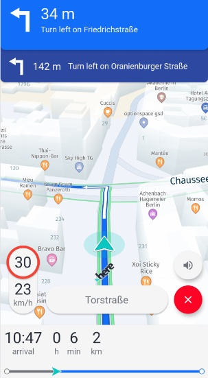

# Get started with Navigation

The HERE SDK enables you to build a comprehensive turn-by-turn navigation experience. With this feature, your app can check the current device location against a calculated route and get navigational instructions just-in-time.

<center><p>
  
  <figcaption>Screenshot: An application running guidance - empowered by the HERE SDK.</figcaption>
</p></center>

Key features include:

- **Automated rendering**: A tailored navigation map view can be optionally rendered with the `VisualNavigator`. Once `startRendering()` is called, it will add a preconfigured `MapMarker3D` instance in form of an arrow to indicate the current direction - and incoming location updates are smoothly interpolated. In addition, the map orientation is changed to the best suitable default values.

- **Tracking mode**: Even without having a route to follow, the HERE SDK supports a tracking mode, which provides information about the current street, the map-matched location and other supporting details such as speed limits.

- **Real-time instructions**: Voice guidance is provided with maneuver notifications that can be fed as a `String` into any platform TTS (Text-To-Speech) solution.

- **Support for warners**: Stay aware with a comprehensive warner system that includes alerts on speed limits, truck restrictions, road signs and many more.

- **Offline support**: Almost all navigation features work also without an internet connection when [offline map](offline-maps.md) data has been cached, installed or preloaded: only a few features require an online connection, for example, when using the `DynamicRouteEngine` to search online for traffic-optimized routes.

The basic principle of turn-by-turn navigation is to frequently receive a location including speed and bearing values. These values are then matched to a street and compared to the desired route. A maneuver instruction is given to let you orient where you are and where you want to go next.

When leaving the route, you can be notified of the deviation in meters. This notification can help you to decide whether or not to calculate a new route. And finally, a location simulator allows you to test route navigation during the development phase.

> #### Note
> Application developers using turn-by-turn navigation are required to thoroughly test their applications in all expected usage scenarios to ensure safe and correct behavior. Application developers are responsible for warning app users of obligations including but not limited to:
> - Do not follow instructions that may lead to an unsafe or illegal situation.
> - Obey all local laws.
> - Be aware that using a mobile phone or some of its features while driving may be prohibited.
> - Always keep hands free to operate the vehicle while driving.
> - Make road safety the first priority while driving.

## How does it work?

1. There are two main entry points to start with navigation:
   1. The `Navigator` class provides all functionality to react on `Location` data. It provides guidance instructions to follow a route accompanied with an extensive warner system that provides all kind of information along the road. The latter is also available in tracking mode without following a route.
   2. The `VisualNavigator` class provides the same features as the headless `Navigator`, but offers a pre-configured 3D map view experience on top. On top, it provides junction views and other optional visual elements.
2. `Location` data needs to be provided. Use your own solution - or use the HERE SDK: The [Get Locations](get-locations.md) guide provides all the details.
3. Voice guidance is supported by giving textual instructions with optional phoneme support and natural guidance information. These strings can be used with any available TTS feature (third-party or native OS).
4. Use the `RoutePrefetcher` to optimize the experience for situations when there is not enough connectivity - or download and install [offline maps](offline-maps.md) to navigate completely without an internet connection.

## Initialize the Navigator or VisualNavigator

With the `VisualNavigator` the HERE SDK provides a ready-made visual experience to start guidance. This component creates a map view with all the required bits to show the progress while advancing on a route. Optionally, you can customize the view or render it completely on your own with the headless `Navigator`.

You can initialize the `Navigator` in the same way as the `VisualNavigator`:

```dart
try {
  _visualNavigator = HERE.VisualNavigator();
} on InstantiationException {
  throw Exception("Initialization of VisualNavigator failed.");
}
```

## Listen for navigation events

Before you can start to navigate to a destination, you need two things:

1. A `Route` to follow. The `Route` must be set to the `Navigator` or `VisualNavigator` instance to start navigation.
2. A location source that periodically tells the `Navigator` or `VisualNavigator` instance where you are.

Make sure to import the following packages to avoid name clashes with the Route / Navigator classes from Flutter:

```dart
import 'package:here_sdk/navigation.dart';
import 'package:here_sdk/routing.dart' as HERE;
```

Unless you have already calculated a route, create one: getting a `Route` instance is shown [here](routing.md). If you only want to start the app in tracking mode, you can skip this step.

> #### Note
> During turn-by-turn navigation, you will get all `Maneuver` information from the `Navigator` or the `VisualNavigator` instance - synced with your current `Location`. As long as you navigate, do not take the `Manuever` data from the `Route` object directly.

The below code snippet shows all the code that is needed to start simulated guidance using simulated `Location` events taken from the `Route`. It uses the `VisualNavigator` instance, so that the HERE SDK will take over the rendering part until `stopRendering()` is called:

```dart
_startGuidance(HERE.Route route) {
  try {
    // Without a route set, this starts tracking mode.
    _visualNavigator = HERE.VisualNavigator();
  } on InstantiationException {
    throw Exception("Initialization of VisualNavigator failed.");
  }

  // This enables a navigation view including a rendered navigation arrow.
  _visualNavigator!.startRendering(_hereMapController!);

  // Hook in one of the many listeners. Here we set up a listener to get instructions on the maneuvers to take while driving.
  // For more details, please check the "navigation_app" example and the Developer Guide.
  _visualNavigator!.eventTextListener = HERE.EventTextListener((HERE.EventText eventText) {
    String text = eventText.text;
    print("Maneuver instruction text: $text");
  });

  // Set a route to follow. This leaves tracking mode.
  _visualNavigator!.route = route;

  // VisualNavigator acts as LocationListener to receive location updates directly from a location provider.
  // Any progress along the route is a result of getting a new location fed into the VisualNavigator.
  _setupLocationSource(_visualNavigator!, route);
}

_setupLocationSource(HERE.LocationListener locationListener, HERE.Route route) {
  try {
    // Provides fake GPS signals based on the route geometry.
    _locationSimulator = HERE.LocationSimulator.withRoute(route, HERE.LocationSimulatorOptions());
  } on InstantiationException {
    throw Exception("Initialization of LocationSimulator failed.");
  }

  _locationSimulator!.listener = locationListener;
  _locationSimulator!.start();
}
```

This code excerpt will start a guidance view and it will print maneuver instructions to the console until you have reached the destination defined in the provided `route` (for the full code including declarations see the [navigation_quick_start_app](https://github.com/heremaps/here-sdk-examples) example). Note that the maneuver instructions are meant to be spoken to a driver and they may contain strings like "Turn left onto Invalidenstraße in 500 meters.". More detailed maneuver instructions are also available - they are showed in the sections below.

Note that above we are using the simulation feature of the HERE SDK to acquire location updates. Of course, you can also feed real location updates into the `VisualNavigator`.

> #### Note
> Unlike for other engines, the `VisualNavigator` or the `Navigator` will automatically try to download online data when reaching regions that have not been cached, installed or preloaded beforehand. And vice versa, both components will make use of offline map data when it is available on a device - even if an online connection is available.

## Fed locations into a navigator

As shown above, you need to provide `Location` instances - as navigation is not possible without getting frequent updates on the current location. Let's take another look on how to fed non-simulated as well as simulated `Location` data into the system.

The navigation component is decoupled from positioning: it is possible to feed in new locations either by implementing a platform positioning solution or by using the HERE SDK positioning feature or by setting up a location simulator.

The basic information flow is:

**Location Provider => Location => (Visual)Navigator => Events**

Note that you can set any `Location` source as "location provider". Only `onLocationUpdated()` has to be called on the `Navigator` or `VisualNavigator`.

It is the responsibility of the developer to feed in valid locations into the `VisualNavigator`. For each received location, the `VisualNavigator` will respond with appropriate events that indicate the progress along the route, including maneuvers and a possible deviation from the expected route. The resulting events depend on the accuracy and frequency of the provided location signals.

When using HERE Positioning, we recommend using `LocationAccuracy.navigation`, as this provides the best results in a navigation context.

> All events are given based on a map-matched location - this is done automatically by the HERE SDK which incorporates an internal map-matcher component to match a raw location signal to the nearest road.

A positioning provider implementation using HERE Positioning can be found on [GitHub](https://github.com/heremaps/here-sdk-examples/blob/master/examples/latest/navigate/flutter/navigation_app/lib/HEREPositioningSimulator.dart). It provides simulated and non-simulated `Location` events.

We recommend to follow the [Positioning](get-locations.md) guide to discover more details on all supported HERE Positioning features.

Both, the `Navigator` and the `VisualNavigator` classes conform to the `LocationListener` interface that defines the `onLocationUpdated()` method to receive locations:

```dart
// Set navigator as delegate to receive locations from HERE Positioning.
// Choose a suitable accuracy for the navigation use case.
_herePositioningProvider.startLocating(_visualNavigator, LocationAccuracy.navigation);
```

Optionally, set the route you want to follow - unless you plan to start in tracking mode.

## Start and stop guidance

While turn-by-turn navigation automatically starts when a `route` is set and the `LocationPrivider` is started, stopping navigation depends on the possible scenario:

Either, you want to stop navigation and switch to tracking mode (see below) to receive map-matched locations while still following a path - or you want to stop navigation without going back to tracking mode. For the first case, you only need to set the current `route` to `null`. This will only stop propagating all turn-by-turn navigation related events, but keep the ones alive to receive map-matched location updates and, for example, speed warning information. Note that propagation of turn-by-turn navigation events is automatically stopped when reaching the desired destination. Once you set a `route` again, all turn-by-turn navigation related events will be propagated again.

If you want to stop navigation without going back to tracking mode - for example, to get only non-map-matched location updates directly from a location provider - it is good practice to stop getting all events from the `VisualNavigator`. For this you should set all listeners individually to `null`.

You can reuse your location provider implementation to consume location updates in your app. With HERE positioning you can set multiple `LocationListener` instances.

When you use the `VisualNavigator`, call `stopRendering()`. Once called, the `MapView` will be no longer under control by the `VisualNavigator`:

- Settings, like map orientation, camera distance or tilt, which may have been altered during rendering are no longer updated. They will keep the last state before `stopRendering()` was called. For example, if the map was tilted during guidance, it will stay tilted. Thus, it is recommended to apply the desired camera settings after `stopRendering()` is called.
- The map will no longer move to the current location - even if you continue to feed new locations into the `VisualNavigator`.
- The default or custom location indicator owned by the `VisualNavigator` will be hidden again.
- Note that all location-based events such as the `RouteProgress` will be still delivered unless you unsubscribe by setting a null listener - see above.

> #### Note
> Since the `VisualNavigator` operates on a `MapView` instance, it is recommended to call `stopRendering()` before destroying a `MapView`. In addition, it is recommended to stop `LocationSimulator` and `DynamicRoutingEngine` in case they were started before. However, when a `MapView` is paused, it is not necessary to also stop the `VisualNavigator`. The `VisualNavigator` stops automatically to render when the `MapView` is paused and it starts rendering when the `MapView` is resumed (when the `VisualNavigator` was rendering before).

## Start and stop tracking

While you can use the `VisualNavigator` class to start and stop turn-by-turn navigation, it is also possible to switch to a tracking mode that does not require a route to follow. This mode is also often referred to as the "driver's assistance mode". It is available for all transport modes - except for public transit. Public transit routes may lead to unsafe and unexpected results when being used for tracking. Although all other transport modes are supported, tracking is most suitable for vehicle transport modes.

To enable tracking, you only need to call:

```dart
 _visualNavigator.route = null;
// And make sure to start your location provider, if it is not already running.
```

Of course, it is possible to initialize the `VisualNavigator` without setting a `route` instance - if you are only interested in tracking mode you don't need to set the route explicitly to null.

> #### Note
> Note that in tracking mode you only get events for listeners such as the `NavigableLocationListener` or the `SpeedWarningListener` that can fire without the need for a route to follow. In general, all warners are supported. Other listeners such as the `RouteProgressListener` do not deliver events when a route is not set.
>
> This enables you to keep your listeners alive and to switch between free tracking and turn-by-turn-navigation on the fly.
>
> Consult the API Reference for an overview to see which listeners work in tracking mode.

Tracking can be useful, when drivers already know the directions to take, but would like to get additional information such as the current street name or any speed limits along the trip.

When tracking is enabled, it is also recommended to enable the `SpeedBasedCameraBehavior`:

```dart
visualNavigator.cameraBehavior = SpeedBasedCameraBehavior();
```

This camera mode is automatically adjusting the camera's location to optimize the map view based on the current driving speed.

In order to stop following the camera, call:

```java
visualNavigator.setCameraBehavior(null);
```

This can be also useful during guidance, if you want to temporarily enable gesture handling. It is recommended to automatically switch back to tracking if turn-by-turn navigation is ongoing - in order to not distract a driver.

## Get maneuver progress events

During navigation, you typically want to attach a few listeners to get notified about the route progress, current location, and the next maneuver to take. The HERE SDK provides many different listeners for different purposes.

Below, we show how to get progress events:

```dart
// Notifies on the progress along the route including maneuver instructions.
// These maneuver instructions can be used to compose a visual representation of the next maneuver actions.
_visualNavigator.routeProgressListener = RouteProgressListener((RouteProgress routeProgress) {
  // Handle results from onRouteProgressUpdated():
  List<SectionProgress> sectionProgressList = routeProgress.sectionProgress;
  // sectionProgressList is guaranteed to be non-empty.
  SectionProgress lastSectionProgress = sectionProgressList.elementAt(sectionProgressList.length - 1);
  print('Distance to destination in meters: ' + lastSectionProgress.remainingDistanceInMeters.toString());
  print('Traffic delay ahead in seconds: ' + lastSectionProgress.trafficDelay.inSeconds.toString());

  // Contains the progress for the next maneuver ahead and the next-next maneuvers, if any.
  List<ManeuverProgress> nextManeuverList = routeProgress.maneuverProgress;

  if (nextManeuverList.isEmpty) {
    print('No next maneuver available.');
    return;
  }
  ManeuverProgress nextManeuverProgress = nextManeuverList.first;

  int nextManeuverIndex = nextManeuverProgress.maneuverIndex;
  Maneuver? nextManeuver = _visualNavigator.getManeuver(nextManeuverIndex);
  if (nextManeuver == null) {
    // Should never happen as we retrieved the next maneuver progress above.
    return;
  }

  ManeuverAction action = nextManeuver.action;
  String roadName = _getRoadName(nextManeuver);
  String logMessage = describeEnum(action) +
      ' on ' +
      roadName +
      ' in ' +
      nextManeuverProgress.remainingDistanceInMeters.toString() +
      ' meters.';

  if (_previousManeuverIndex != nextManeuverIndex) {
    print('New maneuver: $logMessage');
  } else {
    // A maneuver update contains a different distance to reach the next maneuver.
    print('Maneuver update: $logMessage');
  }

  _previousManeuverIndex = nextManeuverIndex;
});
```

With the `routeProgress` event we can access the next maneuver that lies ahead of us. For this we use the `maneuverIndex`:

```dart
// Contains the progress for the next maneuver ahead and the next-next maneuvers, if any.
List<ManeuverProgress> nextManeuverList = routeProgress.maneuverProgress;

if (nextManeuverList.isEmpty) {
  print('No next maneuver available.');
  return;
}
ManeuverProgress nextManeuverProgress = nextManeuverList.first;

int nextManeuverIndex = nextManeuverProgress.maneuverIndex;
Maneuver? nextManeuver = _visualNavigator.getManeuver(nextManeuverIndex);
```

Use `nextManeuver.action` to identify the maneuver a user has to take. The full list of supported `ManeuverAction` enum values can be found in the API Reference.

> #### Note
> A maneuver [icon](https://github.com/heremaps/here-icons/tree/master/icons/guidance-icons/manoeuvers) as indicated by the `ManeuverAction` enum is recommended to be shown as a visual indicator during navigation - while the `Maneuver` instruction text (`nextManeuver.text`) fits more into a list to **preview maneuvers** before starting a trip: these localized instructions are descriptive and will be understandable outside of an ongoing guidance context. However, commonly, they can be presented together with the corresponding `ManeuverAction` icons you can find in the open-source [HERE Icon Library](https://github.com/heremaps/here-icons/tree/master/icons/guidance-icons/manoeuvers). Find more details on this in the [Routing](routing.md) section.

With the data provided by the `RouteProgressListener` we can access detailed information on the progress per `Section` of the passed `Route` instance.

A route may be split into several sections based on the number of waypoints and transport modes. Note that `remainingDistanceInMeters` and `trafficDelay.inSeconds` are already accumulated per section. We check the last item of the `SectionProgress` list to get the overall remaining distance to the destination and the overall estimated traffic delay.

Note that the `trafficDelay.inSeconds` is based upon the time when the `Route` data was calculated - therefore, the traffic delay is not refreshed during guidance. The value is only updated along the progressed sections based on the initial data. Use the `DynamicRoutingEngine` to periodically request optimized routes based on the current traffic situation.

The `Maneuver` information taken from `visualNavigator` can be used to compose a display for a driver to indicate the next action and other useful information like the distance until this action takes place. It is recommended to not use this for textual representations, unless it is meant for debug purposes as shown in the example above. Use voice guidance instead.

## Get street information from maneuvers

Once you have taken a `Maneuver` from the `visualNavigator` or `navigator`, the `Maneuver` class can be useful to display localized street names or numbers (such as highway numbers).

Road texts can be retrieved as follows from a turn-by-turn maneuver:

```dart
String _getRoadName(Maneuver maneuver) {
  RoadTexts currentRoadTexts = maneuver.roadTexts;
  RoadTexts nextRoadTexts = maneuver.nextRoadTexts;

  String? currentRoadName = currentRoadTexts.names.getDefaultValue();
  String? currentRoadNumber = currentRoadTexts.numbersWithDirection.getDefaultValue();
  String? nextRoadName = nextRoadTexts.names.getDefaultValue();
  String? nextRoadNumber = nextRoadTexts.numbersWithDirection.getDefaultValue();

  String? roadName = nextRoadName == null ? nextRoadNumber : nextRoadName;

  // On highways, we want to show the highway number instead of a possible road name,
  // while for inner city and urban areas road names are preferred over road numbers.
  if (maneuver.nextRoadType == RoadType.highway) {
    roadName = nextRoadNumber == null ? nextRoadName : nextRoadNumber;
  }

  if (maneuver.action == ManeuverAction.arrive) {
    // We are approaching the destination, so there's no next road.
    roadName = currentRoadName == null ? currentRoadNumber : currentRoadName;
  }

  // Happens only in rare cases, when also the fallback above is null.
  roadName ??= 'unnamed road';

  return roadName;
}
```

You can get the default road texts directly via `currentRoadTexts.names.getDefaultValue()`, like shown above. In most cases, this will be the name of the road as shown on the local signs.

Alternatively, you can get localized texts for the road name based on a list of preferred languages via `currentRoadTexts.names.getPreferredValueForLocales(locales)`. If no language is available, the default language is returned.

> #### Note
> You can use the `RoadTextsListener` to get notified on the current `RoadTexts` you are driving on, e.g. during tracking mode.

As the location provided by the device's GPS sensor may be inaccurate, the `VisualNavigator` internally calculates a map-matched location that is given to us as part of the `NavigableLocation` object. For example, a street location is expected to be on a navigable path. But it can also be off-track, in case the user has left the road - or if the GPS signal is too poor to find a map-matched location.

It is recommended to use the map-matched location to give the user visual feedback. For example, to update the current map view based on the map-matched location. Only if the location could not be map-matched, such as, when the user is off-road, it may be useful to fallback to the unmatched `originalLocation`. Below we choose to use the rendering capabilities of the `VisualNavigator` to automatically update the map view.

> #### Note
> The methods `nextManeuver.roadTexts`, `nextManeuver.nextRoadTexts` and `nextManeuver.exitSignTexts` are meant to be shown as part of **turn-by-turn maneuvers** during navigation: they are only non-empty when the `Maneuver` is taken from `Navigator` or `VisualNavigator`. If taken from a `Route` instance, these attributes are always empty.

Some roads, such as highways, do not have a road name. Instead, you can try to retrieve the road number. Keep also in mind, that there may be unnamed roads somewhere in the world.

Below table demonstrates the usage of maneuver properties:

| Maneuver Properties | RoutingEngine | Navigator / VisualNavigator | Examples |
|---------------------|---------------|-----------------------------|----------|
| maneuver.text | Provides a non-empty string. | Provides a non-empty string. | Example output for `text`: "Turn right onto Detmolder Straße towards A100." |
| maneuver.roadTexts | Provides empty strings. | Provides non-empty strings. | Example output for `roadTexts.names.getDefaultValue()`: "Stadtring". |
| maneuver.nextRoadTexts | Provides empty strings. | Provides non-empty strings. | Example output for `nextRoadTexts.names.getDefaultValue()`: "Halenseestraße". |
| maneuver.exitSignTexts | Provides empty strings. | Provides non-empty strings. | Example output for `exitSignTexts.getDefaultValue()`: "Hamburg". |

> #### Note
> It is not required to trigger the above events yourself. Instead the `VisualNavigator` will react on the provided locations as coming from the location provider implementation.

## Update ETA and Traffic during navigation

The estimated time of arrival (ETA) can be updated by setting a `TrafficOnRoute` object to the `Navigator` or `VisualNavigator`. For this, it is recommended to periodically call `routingEngine.calculateTrafficOnRoute(...)`.

You can find more details on `TrafficOnRoute` in the [Routing](routing.md#update-traffic-on-route) section. 

## Supported transport modes

Navigation is supported for all available transport modes - except for `PUBLIC_TRANSIT`. Public transit routes may lead to unsafe and unexpected results when being used for navigation.

The transport mode can vary across the `Route`, for example, if you walk through a park to reach a sightseeing spot, you may need to leave a car. After the route is calculated, the transport mode is attached to each `Section` of a `Route` object.

For car, truck, taxi, bus and scooter routes, the location of the device will be map-matched to streets, while for other modes, such as pedestrian routes, locations may be matched - in addition - to unpaved dirt roads and other paths that would not be accessible to drivers. On the other hand, certain roads like highways are not navigable for pedestrians. Bicycle routes can make use of all available paths - except highways.

## Try the Navigation example apps

- All code snippets from the above sections are also available on GitHub as part of the [Navigation example app](https://github.com/heremaps/here-sdk-examples/tree/master/examples/latest/navigate/flutter/navigation_app). This app shows the code in connection and provides a testable driving experience and best practices such as keeping the screen alive during guidance.
- If you are interested in getting background location updates, you can check the related section in the [Positioning](get-locations-enable-background-updates.md) guide. Note that as long as you provide location updates, all navigation events will seamlessly continue to be delivered - even if the device screen is locked or the map view is paused.

Additionally, you can find on [GitHub](https://github.com/heremaps/here-sdk-examples) the "navigation_quick_start_app" example. It shows how to get quickly started using a simulated location source.

Take a also look at the "navigation_custom_app" example on [GitHub](https://github.com/heremaps/here-sdk-examples). This example app demonstrates how the HERE SDK can be set up to navigate to a location with a custom `LocationIndicator`. It illustrates the usage of the default pedestrian and navigation `LocationIndicator` assets. Additionally, the app shows how to customize the guidance view by setting a custom zoom level and tilt.
