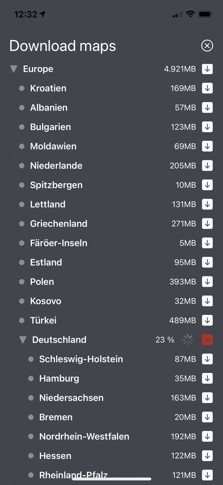

# Install map data

Below we describe how to get offline map data integrated into your application with the `MapDownloader`.

1. Download a list of `Region` objects. Optionally, this list can be localized with local region names. Once you have this list, you can pick the `RegionId` you want to download and pass it as download request to the `MapDownloader`.
2. Use the `MapDownloader` to download a single `Region` or a list of regions. You can also download several regions in parallel. Show the download progress to the user by setting a `DownloadRegionsStatusListener`.
3. Use the `MapUpdater` to update already downloaded regions and the map cache to a newer map version.

Once the download has completed, the map is ready to be used. If a device is offline, it will automatically show the downloaded region when the camera's target is pointed to that region.

> #### Note
> If a download failed, the HERE SDK will still be in a fully operable state. Just try to download again, until the progress has reached 100% and the status finally indicates that the operation is completed. If the issues are more severe, you can try to repair: See the repair section below for more details.
>
> It is not recommended to keep downloading or updating map data while an app is running in the background. As a best practice, users should be notified to `pause()` or `cancel()` ongoing downloads if they cannot keep running the app in foreground. Additionally, consider providing a `resume()` option when the app is resumed after being paused.
>
> Consider writing platform-specific code to keep the device active (particularly the GPU and CPU) and prevent the app from entering an idle state. Alternatively, inform users to keep the screen on to maintain app functionality

Since map data for regions, countries, or entire continents can be several hundred megabytes, downloads may take a significant amount of time, depending on factors like available bandwidth. Additionally, a download may fail if the connection times out and cannot recover. For the best user experience, it is recommended to allow users to cancel ongoing operations and monitor the progress until the map download is successful.

> #### Note
> To get a quick overview of how all of this works, you can take a look at the ["offline_maps_app"](https://github.com/heremaps/here-sdk-examples/blob/master/examples/latest/navigate/flutter/offline_maps_app/lib/OfflineMapsExample.dart) class. It contains all code snippets shown below and it is part of the "offline_maps_app" example app you can find on [GitHub](https://github.com/heremaps/here-sdk-examples/tree/master/examples/latest/navigate/flutter/offline_maps_app).

## Use the MapDownloader

You can use the `MapDownloader` once per `SDKNativeEngine`:

```dart
SDKNativeEngine? sdkNativeEngine = SDKNativeEngine.sharedInstance;
if (sdkNativeEngine == null) {
  throw ("SDKNativeEngine not initialized.");
}

// Create MapDownloader in background to not block the UI thread.
MapDownloader.fromSdkEngineAsync(sdkNativeEngine, (mapDownloader) {
  _mapDownloader = mapDownloader;
});
```

Usually, the `SDKNativeEngine` is automatically initialized when you start the app to show a `MapView`. Therefore, you can access its instance at runtime and obtain the `MapDownloader` from it.

> #### Note
> Consider using a separate loader method or class, for example use multiple `Futures` to await until all instances are ready. Displaying a loading indicator during this process can enhance the user experience. This approach allows you to use the instance(s) in your class confidently, without the need for null checks. Typically, creating the `MapDownloader` and `MapUpdater` (see below) completes in a negligible amount of time.

By default, the downloaded map data will be stored to a default location:

```dart
// Note that the default storage path can be adapted when creating a new SDKNativeEngine.
String storagePath = sdkNativeEngine.options.cachePath;
_showDialog("This example allows to download the region Switzerland.", "Storage path: $storagePath");
```

As stated in the comment, you can change that storage location, if you wish so - but then you need to create a new `SDKNativeEngine` instance as shown in the [Key Concepts](key-concepts.md) section and set the new cache path together with your credentials as part of the `SDKOptions`. Note that the storage path is unique for your credentials key.

## Download a list of regions

Each downloadable `Region` is identified by a unique `RegionId`. In order to know, which regions are available and which `RegionID` belongs to which `Region`, you need to download a list of all available offline maps. This contains regions from the entire world.

> #### Note
> Each `Region` can contain multiple children and each child represents a subset of its parent `Region` - when you download the parent, then the child regions are automatically included. If you are interested only in smaller portions of an area you can traverse the child regions. Usually, the top-level regions represent continents with countries as children. For the sake of simplicity, below we only look for downloadable countries and ignore any children of children and their children (and so on).

The code below downloads the list of downloadable regions and stores the available `Region` elements in a list for later use:

```dart
// Download a list of Region items that will tell us what map regions are available for later download.
_mapDownloader.getDownloadableRegionsWithLanguageCode(LanguageCode.deDe,
    (MapLoaderError? mapLoaderError, List<Region>? list) {
  if (mapLoaderError != null) {
    _showDialog("Error", "Downloadable regions error: $mapLoaderError");
    return;
  }

  // If error is null, it is guaranteed that the list will not be null.
  _downloadableRegions = list!;

  for (Region region in _downloadableRegions) {
    print("RegionsCallback: " + region.name);
    List<Region>? childRegions = region.childRegions;
    if (childRegions == null) {
      continue;
    }

    // Note that this code ignores to list the children of the children (and so on).
    for (Region childRegion in childRegions) {
      var sizeOnDiskInMB = childRegion.sizeOnDiskInBytes / (1024 * 1024);
      String logMessage = "Child region: " +
          childRegion.name +
          ", ID: " +
          childRegion.regionId.id.toString() +
          ", Size: " +
          sizeOnDiskInMB.toString() +
          " MB";
      print("RegionsCallback: " + logMessage);
    }
  }

  var listLenght = _downloadableRegions.length;
  _showDialog("Contintents found: $listLenght", "Each continent contains various countries. See log for details.");
});
```

> #### Note
> The response contains either an error or a result: `MapLoaderError` and `List<Region>` can never be null at the same time - or non-null at the same time.

Each region can contain child regions. For example, Europe contains Germany, France and Switzerland - and many more child regions. The `sizeOnDiskInBytes` parameter tells you how much space the downloaded map will occupy on the device's file system when it's uncompressed after the download is completed. It makes sense to show this to the user before starting the download, as the available space on a device may be limited.

<center><p>
  
  <figcaption>Screenshot: Showing an example how downloadable maps could be indicated to users.</figcaption>
</p></center>

## Download a region

Once you know the `RegionId`, you can use it to start downloading the map data. Each `Region` instance contains a localized `name` and other data, such as the size of the downloaded map. When the map data is downloaded, all data is compressed and will be unpacked automatically onto the device's disk once the download is complete.

Below we search in the downloaded list of regions to find the `Region` element for Switzerland. Note that we have requested the region list to be localized in German in the step above:

```dart
// Finds a region in the downloaded region list.
// Note that we ignore children of children (and so on): For example, a country may contain downloadable sub regions.
// For this example, we just download the country including possible sub regions.
Region? _findRegion(String localizedRegionName) {
  Region? downloadableRegion;
  for (Region region in _downloadableRegions) {
    if (region.name == localizedRegionName) {
      downloadableRegion = region;
      break;
    }

    List<Region>? childRegions = region.childRegions;
    if (childRegions == null) {
      continue;
    }

    for (Region childRegion in childRegions) {
      if (childRegion.name == localizedRegionName) {
        downloadableRegion = childRegion;
        break;
      }
    }
  }

  return downloadableRegion;
}
```

Once we know the `Region`, we can use it's `RegionId` to start the download. We pass the unique ID into a list, so we can download multiple regions with the same request. Here, we download only one region:

```dart
// Find region for Switzerland using the German name as identifier.
// Note that we requested the list of regions in German above.
String swizNameInGerman = "Schweiz";
Region? region = _findRegion(swizNameInGerman);

if (region == null) {
  _showDialog("Error", "Error: The Swiz region was not found. Click 'Get Regions' first.");
  return;
}

// For this example we download only one country.
List<RegionId> regionIDs = [region.regionId];

MapDownloaderTask mapDownloaderTask = _mapDownloader.downloadRegions(
    regionIDs,
    DownloadRegionsStatusListener((MapLoaderError? mapLoaderError, List<RegionId>? list) {
      // Handle events from onDownloadRegionsComplete().
      if (mapLoaderError != null) {
        _showDialog("Error", "Download regions completion error: $mapLoaderError");
        return;
      }

      // If error is null, it is guaranteed that the list will not be null.
      // For this example we downloaded only one hardcoded region.
      String message = "Download Regions Status: Completed 100% for Switzerland! ID: " + list!.first.id.toString();
      print(message);
    }, (RegionId regionId, int percentage) {
      // Handle events from onProgress().
      String message =
          "Download of Switzerland. ID: " + regionId.id.toString() + ". Progress: " + percentage.toString() + "%.";
      print(message);
    }, (MapLoaderError? mapLoaderError) {
      // Handle events from onPause().
      if (mapLoaderError == null) {
        _showDialog("Info", "The download was paused by the user calling mapDownloaderTask.pause().");
      } else {
        _showDialog("Error",
            "Download regions onPause error. The task tried to often to retry the download: $mapLoaderError");
      }
    }, () {
      // Hnadle events from onResume().
      _showDialog("Info", "A previously paused download has been resumed.");
    }));

_mapDownloaderTasks.add(mapDownloaderTask);
```

The `DownloadRegionsStatusListener` provides four events. The second one tells us the progress while the download is ongoing, while the first one notifies once the download has completed. Note that the download can also complete with a `MapLoaderError`, so it's worth to check if something went wrong.

> #### Note
> The response for `lambda_onDownloadRegionsComplete()` contains either an error or a result: `MapLoaderError` and `List<RegionId>` can never be null at the same time - or non-null at the same time.

The pause event notifies when a download was paused by the user or the task itself. Internally, the HERE SDK will retry to download a region when it was interrupted, that is due to a bad network connection. If this happens too often, the `MapLoaderError` for `lambda_onPause()` is populated and the download pauses. A paused `MapDownloaderTask` can only be resumed by the user, which will be also indicated by the related event. Especially for larger regions it may be convenient to pause a download until the connection gets better, for example. When resumed, the download will continue at the progress where it stopped and no already downloaded map data will be lost. Note that calling `downloadRegions()` for a paused region will have the same effect as calling `resume()` on the original task and the progress will continue where it left off.

After kicking off the download, we get an immediate return value to be able to cancel the ongoing asynchronous download operation. Above, we store the `MapDownloaderTask` into a list, as a user might trigger the above code multiple times.

To cancel all ongoing downloads, you can use the following code snippet:

```dart
for (MapDownloaderTask mapDownloaderTask in _mapDownloaderTasks) {
  mapDownloaderTask.cancel();
}
int taskLength = _mapDownloaderTasks.length;
_showDialog("Note", "Cancelled $taskLength download tasks in list.");
_mapDownloaderTasks.clear();
```

Note that a `MapDownloaderTask` that was cancelled cannot be resumed again, but you can start a fresh download request again.

A usage example is available on [GitHub](https://github.com/heremaps/here-sdk-examples) as part of the "offline_maps_app" example app.

## Repair broken maps

It is not recommended to keep downloading or updating map data while an app is running in the background. Note that the HERE SDK offers methods to `pause()` and to `resume()` downloads as shown in above section. For example, when an app is going to background or is resumed. It is recommended to inform users in such cases.

However, it may happen that an app gets closed before a map update operation can be completed - for example, due to a crash. So, in worst case an intermediate state may occur on the disk of the device.

The HERE SDK provides a convenient way to check for such issues with the `getInitialPersistentMapStatus()` method. It also allows to repair a broken map, if possible.

```dart
_checkInstallationStatus() {
  // Note that this value will not change during the lifetime of an app.
  PersistentMapStatus persistentMapStatus = _mapDownloader.getInitialPersistentMapStatus();
  if (persistentMapStatus != PersistentMapStatus.ok) {
    // Something went wrong after the app was closed the last time. It seems the offline map data is
    // corrupted. This can eventually happen, when an ongoing map download was interrupted due to a crash.
    print("PersistentMapStatus: The persistent map data seems to be corrupted. Trying to repair.");

    // Let's try to repair.
    _mapDownloader.repairPersistentMap((PersistentMapRepairError? persistentMapRepairError) {
      if (persistentMapRepairError == null) {
        print("RepairPersistentMap: Repair operation completed successfully!");
        return;
      }

      // In this case, check the PersistentMapStatus and the recommended
      // healing option listed in the API Reference. For example, if the status
      // is "pendingUpdate", it cannot be repaired, but instead an update
      // should be executed. It is recommended to inform your users to
      // perform the recommended action.
      print("RepairPersistentMap: Repair operation failed: " + persistentMapRepairError.toString());
    });
  }
}
```

> #### Note
> It is recommended to inform the user that there might be an issue with the downloaded map data. Such a dialog can be shown on app side before performing a repair operation or any other follow-up action that might be necessary if the repair operation fails. However, calling `getInitialPersistentMapStatus()` and `repairPersistentMap()` can be performed silently to see if such a notification is necessary or not.

In worst case, if the repair operation fails, the map data needs to be removed and downloaded again. You can try to call `deleteRegions()` programmatically and clear the map cache via `SDKCache` by calling `clearCache​()`. In this case, it is recommend to notify the user and to restart the application.

Alternatively, you can manually delete the data: the path for downloaded regions and the cache can be retrieved from the `SDKOptions` via the `persistentMapStoragePath` and `cachePath` properties.
