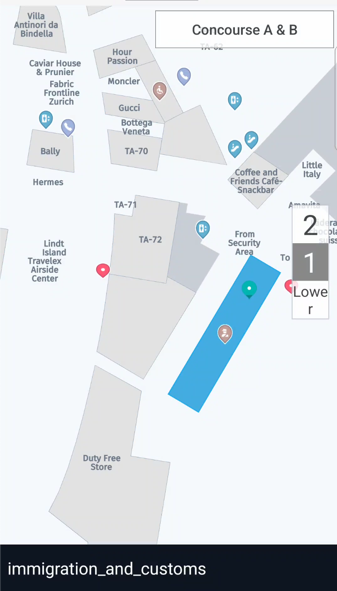

# Use the Indoor Map component

HERE Indoor Map provides functionality to load, show, and interact with private venues on a map. For more information on HERE Indoor Map, see the [HERE Indoor Map Guide](https://www.here.com/docs/bundle/indoor-map-user-guide/page/README.html).

> #### Note
>
> If you are a venue owner and are interested in leveraging HERE Indoor Map with the HERE SDK, contact us at
>
> [venues.support@here.com](mailto:venues.support@here.com).

<center><p>
  
  <figcaption>An airport venue with a customized floor switcher.</figcaption>
</p></center>

Currently, the HERE SDK only supports private venues, therefore your venue data will only be shown in your app. By default, no venues are visible on the map. Each of your venues receives a unique venue ID that is tied to your HERE SDK credentials.

## Initialize the VenueEngine

Before you can begin using the HERE Indoor Map API, the `VenueEngine` instance must be created and started. This can be done after a map initialization, however The best time to create the `VenueEngine` is after the map loads a scene:

```dart
class MyApp extends StatelessWidget {
  final VenueEngineState _venueEngineState = VenueEngineState();

  @override
  Widget build(BuildContext context) {
    return MaterialApp(
      title: 'HERE SDK for Flutter - Venues',
      home: Scaffold(
        appBar: AppBar(
          title: const Text('HERE SDK for Flutter - Venues'),
        ),
        body: Column(children: [
          Expanded(
            child: Stack(children: <Widget>[
              // Add a HERE map.
              HereMap(onMapCreated: _onMapCreated),
              // Add a venue engine widget, which helps to control venues
              // on the map.
              VenueEngineWidget(state: _venueEngineState)
            ]),
          ),
        ]),
      ),
    );
  }

  void _onMapCreated(HereMapController hereMapController) {
    // Load a scene from the HERE SDK to render the map with a map scheme.
    hereMapController.mapScene.loadSceneForMapScheme(MapScheme.normalDay,
        (MapError error) {
      if (error != null) {
        print('Map scene not loaded. MapError: ${error.toString()}');
        return;
      }
      // Hide the extruded building layer, so that it does not overlap
      // with the venues.
      hereMapController.mapScene.disableFeatures([MapFeatures.extrudedBuildings]);

      // Create a venue engine object. Once the initialization is done,
      // a callback will be called.
      var venueEngine;
      try {
        venueEngine = VenueEngine(_onVenueEngineCreated);
        _venueEngineState.set(hereMapController, venueEngine, _geometryInfoState);
      } on InstantiationException catch(e){
        print('error caught: $e');
      }
    });
  }

  void _onVenueEngineCreated() {
    _venueEngineState.onVenueEngineCreated();
  }

}
```

Once the `VenueEngine` is initialized, a callback is called. From this point on, there is access to both the `VenueService` and the `VenueMap`. A `VenueService` is used to load venues, and a `VenueMap` controls the venues on the map. Inside the callback, all needed listeners can be added, and then the  `VenueEngine` must be started. The platform map catalog `HRN` must be set once `VenueEngine` is started.

> #### Note
>
> Setting HRN is optional. If a user does not set HRN, default collection HRN is automatically selected. If a user want to use any other collection, respective HRN can be set. An error log is generated that indicates missing or invalid HRN values. For more information on how you can receive a valid HRN string for your project, see the [HERE Indoor Map Guide](https://www.here.com/docs/bundle/sdk-for-flutter-navigate-developer-guide/page/topics/venues.html).

```dart
class VenueEngineWidget extends StatefulWidget {
  final VenueEngineState state;

  VenueEngineWidget({required this.state});

  @override
  VenueEngineState createState() => state;
}

// The VenueEngineState listens to different venue events and helps another
// widgets react on changes.
class VenueEngineState extends State<VenueEngineWidget> {
  late VenueServiceListener _serviceListener;

  void onVenueEngineCreated() {
    var venueMap = venueEngine!.venueMap;
    // Add needed listeners.
    _serviceListener = VenueServiceListenerImpl();
    _venueEngine!.venueService.addServiceListener(_serviceListener);

    //Lets user download topologies for current session.
    _venueEngine!.venueService.loadTopologies();

    // Start VenueEngine. Once authentication is done, the authentication
    // callback will be triggered. Afterwards, VenueEngine will start
    // VenueService. Once VenueService is initialized,
    // VenueServiceListener.onInitializationCompleted method will be called.
    venueEngine!.start(_onAuthCallback);

    if(HRN != "") {
      // Set platform catalog HRN
      venueEngine!.venueService.setHrn(HRN);
    }
  }
}
```

Once the `VenueEngine` is started,it authenticates using the current credentials, and then starts the `VenueService`. Once the `VenueService` is initialized, the `VenueServiceListener.onInitializationCompleted()` method is called:

```dart
// Listener for the VenueService event.
class VenueServiceListenerImpl extends VenueServiceListener {
  @override
  onInitializationCompleted(VenueServiceInitStatus result) {
    if (result != VenueServiceInitStatus.onlineSuccess) {
      print("VenueService failed to initialize!");
    }
  }

  @override
  onVenueServiceStopped() {}
}
```

## Start the VenueEngine using a token

The `VenueEngine` can be started using a valid HERE Indoor Platform project token. For additional information on the HERE platform project management and project workflows refer to [HERE Platform Project management](https://www.here.com/docs/bundle/identity-and-access-management-developer-guide/page/topics/manage-projects.html)

```dart
class VenueEngineWidget extends StatefulWidget {
  final VenueEngineState state;

  VenueEngineWidget({required this.state});

  @override
  VenueEngineState createState() => state;
}

// The VenueEngineState listens to different venue events and helps another
// widgets react on changes.
class VenueEngineState extends State<VenueEngineWidget> {
  late VenueServiceListener _serviceListener;

  void onVenueEngineCreated() {
    var venueMap = venueEngine!.venueMap;
    // Add needed listeners.
    _serviceListener = VenueServiceListenerImpl();
    _venueEngine!.venueService.addServiceListener(_serviceListener);

    // Start VenueEngine by replacing TOKEN_GOES_HERE with token you have in String data type.
    // Afterwards, VenueEngine will start VenueService. Once VenueService is initialized,
    // VenueServiceListener.onInitializationCompleted method will be called.
    venueEngine!.startWithToken("TOKEN_GOES_HERE");
  }
}
```

## Try the Indoor Map example app

A full example showing usage of the map tap event with venues is available in the "indoor_map_app" example app, available on [GitHub](https://github.com/heremaps/here-sdk-examples).
